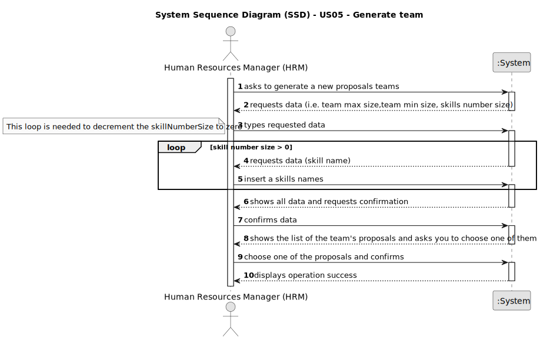

# US05 - Generate team.

## 1. Requirements Engineering

### 1.1. User Story Description

As a HRM, I want to generate a team proposal automatically.

### 1.2. Customer Specifications and Clarifications 

**From the specifications document:**

> A team has a fixed number of collaborators with different skills.

**From the client clarifications:**

> **Question:**
>1. What information will the customer provide?
> 2. What should the output of the automation be? (should it just store the team proposal or show it to the customer?)
     Will the team proposal be a document about all the instructions of each team member/worker?
>
> **Answer:** The systems provide team proposals and HRM can accept of refuse the proposals. In the future (not in this
> sprint) HRM may decide to edit the team.

> **Question:**
> How does it generate the team if there are not enough employees?
> How does he propose a team, for what purpose? (Is there any predefinition)?
> What are the input data to automatically generate a team?
>
> **Answer:** The system should provide information why it can't generate a team.
> There is no purpose, at least in this sprint.
> the max size of the team (for instance 4)
> and the skill needed: 4 tree pruner and 1 light vehicle driver
> meaning that one team member have 2 skills.

> **Question:**
> I would like to ask if, in this US, there should be any more information in the team generated beyond the
> collaborators in which it consists?
>
> I would also like to know if a collaborator can be in more than one team at the same time?
>
> **Answer:**
> The information shouldd contain each of team members and the its skills.
>
> no;

> **Question:**
> I would to know which business rules apply for the input data to generate a team proposal.
>
> **Answer:**
> max and min team size, and a a list of skills needed.
> For instance:
> min: 3
> max: 4

> **Question:**
> Are the skills(input) typed or selected
>
>Does the output show the team members with or without their skills?
>
> **Answer:**
> the ux/ui is up to the dev team.

### 1.3. Acceptance Criteria

* **AC1:** The maximum team size and the set of skills need to be supplied by the HRM.
* **AC2:** The number of collaborators(Min and Max) must be an integer and positive above zero.
* **AC3:** The number Max size of collaborators must be an integer and positive above or equals a Min size.
* **AC4:** The skills number size must be an integer and positive above a zero.
* **AC5:** All required fields must be filled in.

### 1.4. Found out Dependencies

* There is a dependency on "US01 - Create a skills" as there must be at least one skill to create a proposal.
* There is a dependency on "US03 - Register a Collaborator" there must be at least one Collaborator registered in the
  system.

### 1.5 Input and Output Data

**Input Data:**

* Typed data:
    * a team max size;
    * a team min size;
    * a number skills size.
    * a name skills.

**Output Data:**

* List of team proposals
* (In)Success of the operation

### 1.6. System Sequence Diagram (SSD)

### 1.7 Other Relevant Remarks

n/a