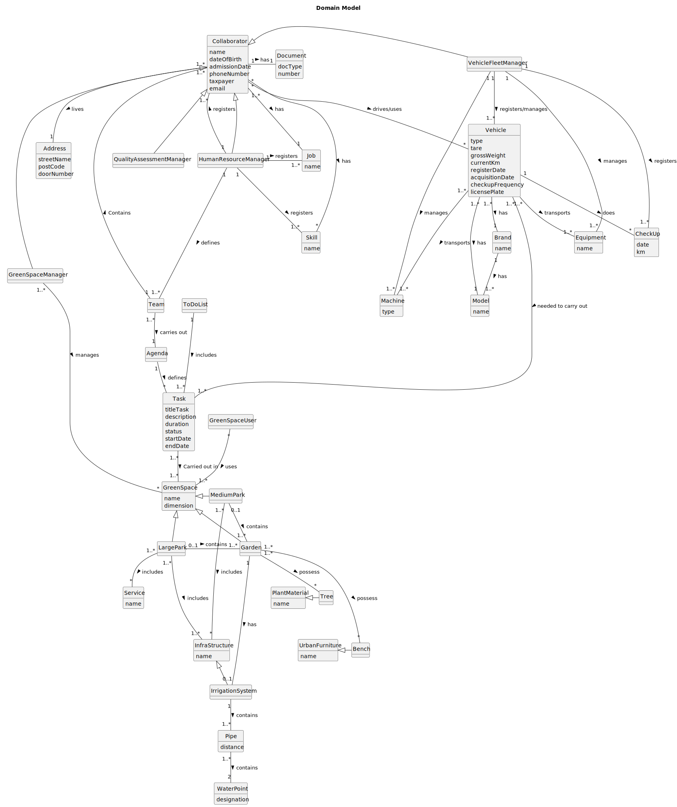

# OO Analysis

The construction process of the domain model is based on the client specifications, especially the nouns (for
_concepts_) and verbs (for _relations_) used.

## Rationale to identify domain conceptual classes

To identify domain conceptual classes, start by making a list of candidate conceptual classes inspired by the list of
categories suggested in the book "Applying UML and Patterns: An Introduction to Object-Oriented Analysis and Design and
Iterative Development".

### _Conceptual Class Category List_

**Business Transactions**

* Skills
* Vehicles
* Job
* Collaborator
* Team
* Check-up
* Pipe
* WaterPoint
* IrrigationSystem

---

**Transaction Line Items**

* Skills
* Vehicles
* WaterPoint
* Pipe

---

**Product/Service related to a Transaction or Transaction Line Item**

* Check-up

---

**Transaction Records**

* Collaborator
* Skills
* Job
* Vehicles

---  

**Roles of People or Organizations**

* Collaborator
* (HRM) Human Resources Manager
* (VFM) Vehicle and Equipment Fleet Manager
* (GSM) Green Spaces Manager
* (GSU) Green Spaces User
* (QAM) Software Quality Assessment Team Manager

---

**Places**

* Garden
* Medium-sized park
* Large-sized par

---

**Noteworthy Events**

*

---

**Physical Objects**

* Vehicles
* Machines
* Equipments
* UrbanFurniture
* PlantMaterial
* InfraStructure

---

**Descriptions of Things**

*

---

**Catalogs**

*

---

**Containers**

* GreenSpace
* Agenda
* ToDoList
* Team
* Collaborator

---

**Elements of Containers**

* Infrastructure
* Wooded garden area
* Equipment
* Service
* Task
* Collaborator
* Skill

---

**Organizations**

* MusgoSublime (MS)

---

**Other External/Collaborating Systems**

* Authentication System

---

**Records of finance, work, contracts, legal matters**

*

---

**Financial Instruments**

*

---

**Documents mentioned/used to perform some work/**

* Agenda
* ToDoList
* Check-up

---

## Rationale to identify associations between conceptual classes

An association is a relationship between instances of objects that indicates a relevant connection and that is worth of
remembering, or it is derivable from the List of Common Associations:

| Concept (A) 	             |     Association     |              Concept (B) |
|---------------------------|:-------------------:|-------------------------:|
| Collaborator              |        Has	         |                      Job |
| Collaborator  	           |  Drives/Uses    	   |                  Vehicle |
| Collaborator  	           |       Has   	       |                    Skill |
| Collaborator              |   Generalization    | QualityAssessmentManager |
| Collaborator              |   Generalization    |     HumanResourceManager |
| Collaborator              |   Generalization    |      VehicleFleetManager |
| Collaborator              |   Generalization    |        GreenSpaceManager |
| Collaborator              |        Lives        |                  Address |
| Team  	                   |     Contains  	     |             Collaborator |
| Team  	                   |   Carries Out  	    |                   Agenda |
| Agenda  	                 |      defines 	      |                     Task |
| HumanResourceManager      |      Registers      |                      Job |
| HumanResourceManager      |      Registers      |             Collaborator |     
| HumanResourceManager      |      Registers      |                    Skill |
| HumanResourceManager      |       Defines       |                     Team |
| VehicleFleetManager       |       Manages       |                  Machine |
| VehicleFleetManager       |       Manages       |                Equipment |
| VehicleFleetManager       |  Registers/Manages  |                  Vehicle |
| VehicleFleetManager       |      Registers      |                  CheckUp |
| Vehicle                   |        Does         |                  CheckUp |
| Vehicle                   | Needed to carry out |                     Task |
| Vehicle                   |     Transports      |                  Machine |
| Vehicle                   |     Transports      |                Equipment |
| Vehicle                   |         Has         |                    Brand |
| Vehicle                   |         Has         |                    Model |
| Green Spaces Manager(GSM) |       Manages       |             Green Spaces |
| Green Spaces User(GSU)    |        Uses         |             Green Spaces |
| Green Space               |   Generalization    |                   Garden |
| Green Space               |   Generalization    |               MediumPark |
| Green Space               |   Generalization    |                LargePark |
| ToDoList                  |      Includes       |                     Task |
| IrrigationSystem          |      Contains       |                     Pipe |
| Pipe                      |      Contains       |               WaterPoint |
| InfraStructure            |   Generalization    |         IrrigationSystem |
| Garden                    |         Has         |         IrrigationSystem |
| Garden                    |       Possess       |                     Tree |
| Garden                    |       Possess       |                    Bench |
| MediumPark                |      Includes       |           InfraStructure |
| MediumPark                |      Contains       |                   Garden |
| LargePark                 |      Includes       |           InfraStructure |
| LargePark                 |      Includes       |                  Service |
| LargePark                 |      Contains       |                   Garden |
| Task                      |   Carried out in    |               GreenSpace |
| PlantMaterial             |   Generalization    |                     Tree |
| UrbanFurniture            |   Generalization    |                    Bench |
| Brand                     |         Has         |                    Model |

## Domain Model

**Do NOT forget to identify concept atributes too.**

**Insert below the Domain Model Diagram in a SVG format**

