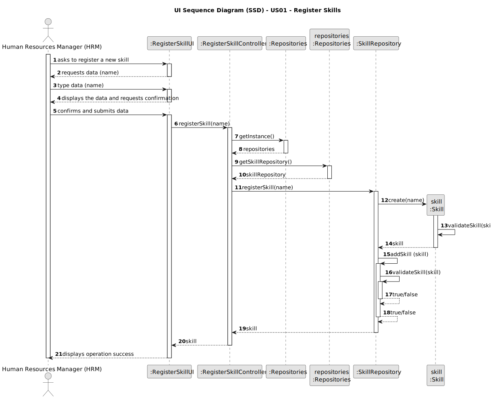
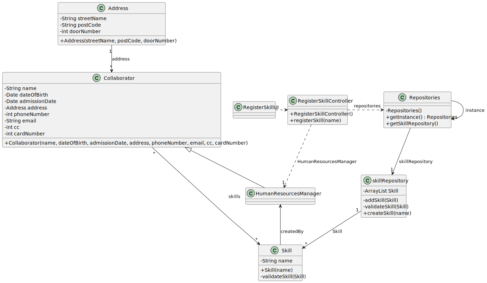

# US01 - Register Skill.

## 3. Design - User Story Realization 

### 3.1. Rationale

_**Note that SSD - Alternative One is adopted.**_

| Interaction ID | Question: Which class is responsible for...   | Answer                  | Justification (with patterns)                                                                                 |
|:---------------|:----------------------------------------------|:------------------------|:--------------------------------------------------------------------------------------------------------------|
| Step 1  		     | 	... interacting with the actor?              | RegisterSkillUI         | Pure Fabrication: there is no reason to assign this responsibility to any existing class in the Domain Model. |
| 			  		        | 	... coordinating the US?                     | RegisterSkillController | Controller                                                                                                    |
| 			  		        | 	... instantiating a new Skill?               | SkillRepository         | Pure Fabrication: they form a collection of objects that do not “belong” to any domain object/class.          |
| 			  		        | 							                                       | SkillRepository         | IE: knows/has its own Skill                                                                                   |
| 			  		        | 							                                       | Skill                   | IE: knows its own data (e.g. name)                                                                            |
| Step 2  		     | 	...saving the inputted data?                 | Skill                   | IE: object created in step 1 has its own data.                                                                |
| Step 3  		     | 	... validating all data (local validation)?  | Skill                   | IE: owns its data.                                                                                            | 
| 			  		        | 	... validating all data (global validation)? | SkillRepository         | IE: knows all its skills.                                                                                     | 
| 			  		        | 	... saving the created task?                 | SkillRepository         | IE: owns all its skills.                                                                                      | 
| Step 4  		     | 	... informing operation success?             | RegisterSkillUI         | IE: is responsible for user interactions.                                                                     | 

### Systematization ##

According to the taken rationale, the conceptual classes promoted to software classes are: 

* Skill

Other software classes (i.e. Pure Fabrication) identified: 

* RegisterSkillUI
* RegisterSkillController
* SkillRepository

## 3.2. Sequence Diagram (SD)

### Full Diagram

This diagram shows the full sequence of interactions between the classes involved in the realization of this user story.

### Split Diagrams

n/a

## 3.3. Class Diagram (CD)

