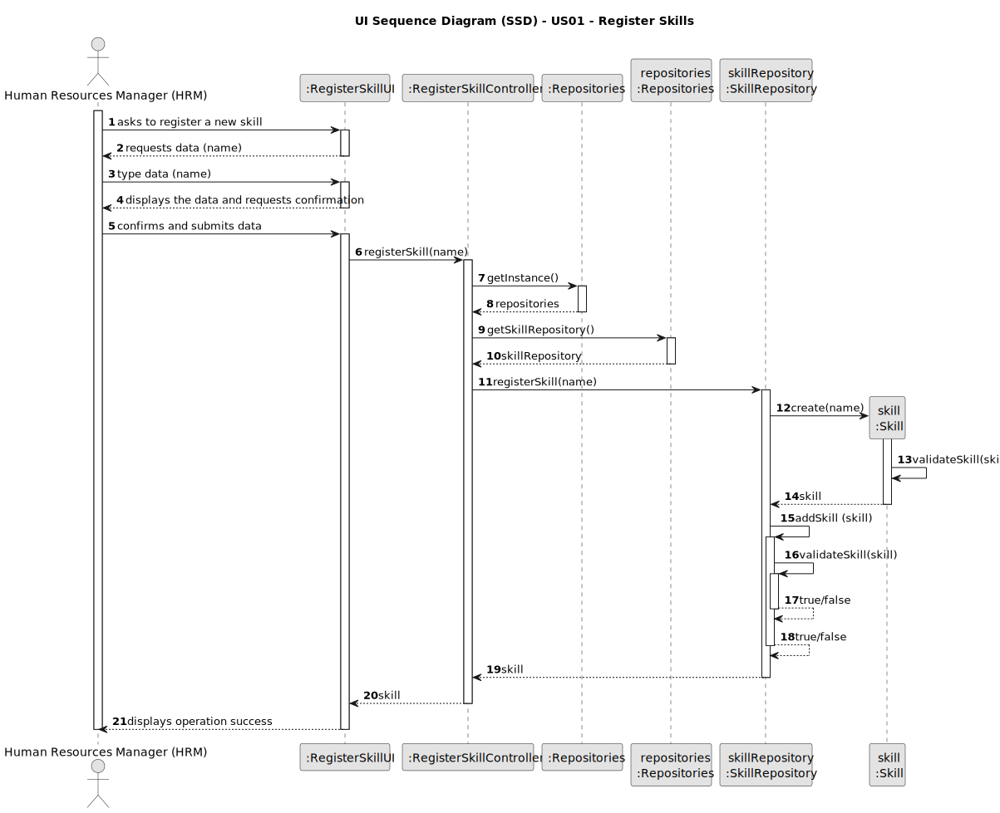
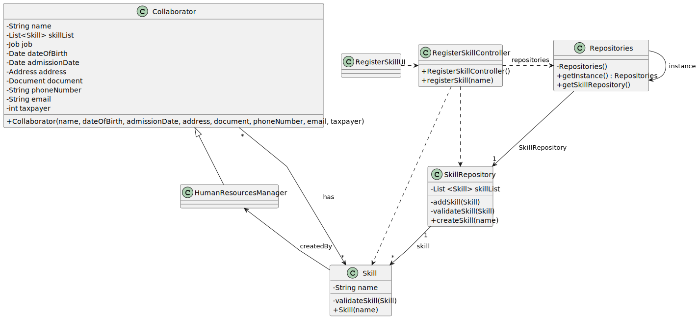

# US01 - Register Skill.

## 3. Design - User Story Realization 

### 3.1. Rationale

_**Note that SSD - Alternative One is adopted.**_

| Interaction ID | Question: Which class is responsible for...   | Answer                  | Justification (with patterns)                                                                                 |
|:---------------|:----------------------------------------------|:------------------------|:--------------------------------------------------------------------------------------------------------------|
| Step 1  		     | 	... interacting with the actor?              | RegisterSkillUI         | Pure Fabrication: there is no reason to assign this responsibility to any existing class in the Domain Model. |
| 			  		        | 	... coordinating the US?                     | RegisterSkillController | Controller                                                                                                    |
| 			  		        | 	... instantiating a new Skill?               | Collaborator            | Creator (Rule 1,2): in the DM Collaborator has a Skill.                                                       |
| 			  		        | ... knowing the user using the system?        | UserSession             | IE: cf. A&A component documentation.                                                                          |
| 			  		        | 							                                       | Collaborator            | IE: knows its own data (e.g. name,dateOfBirth,admissionDate,address,phoneNumber,email,cc,cardNumber)          |
| Step 2  		     | 							                                       |                         |                                                                                                               |
| Step 3  		     | 	...saving the inputted data?                 | Skill                   | IE: object created in step 1 has its own data.                                                                |
| Step 4  		     | 							                                       |                         |                                                                                                               |              
| Step 5  		     | 	... validating all data (local validation)?  | Skill                   | IE: owns its data.                                                                                            | 
| 			  		        | 	... validating all data (global validation)? | Collaborator            | IE: knows all its skill.                                                                                      | 
| 			  		        | 	... saving the created Skill?                | Collaborator            | IE: owns all its skill.                                                                                       | 
| Step 6  		     | 	... informing operation success?             | RegisterSkillUI         | IE: is responsible for user interactions.                                                                     | 

### Systematization ##

According to the taken rationale, the conceptual classes promoted to software classes are: 

* Collaborator
* Skill

Other software classes (i.e. Pure Fabrication) identified: 

* RegisterSkillUI
* RegisterSkillController

## 3.2. Sequence Diagram (SD)

### Diagrams

The following diagram shows the same sequence of interactions between the classes involved in the realization of this user story, but it is split in partial diagrams to better illustrate the interactions between the classes.

It uses Interaction Occurrence (a.k.a. Interaction Use).

**Register Skill**

## 3.3. Class Diagram (CD)

