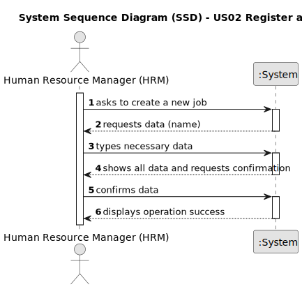

# US02 - Register a job.

## 1. Requirements Engineering

### 1.1. User Story Description

As an HRM, I want to register a job that a collaborator need to have.

### 1.2. Customer Specifications and Clarifications 

**From the specifications document:**

> Jobs can only be registered by a Human Resources Manager (HRM).

**From the client clarifications:**

> **Question:** Quais são os dados de entrada para a criação de uma profissão?
>
> **Answer:** o Nome da profissão:
jardineiro
calceteiro
electricista
condutor
...

> **Question:** What are the acceptance criteria?
When are creating a job that already exit, what the system do?
>
> **Answer:**
By definition a set can´t have duplicates. Assuring no duplicates is not a business rule is a tecnichal issue.

> **Question:** Para a US02, gostaria de esclarecer o seguinte:
>- É relevante associar uma área ou setor específico a cada Job? (Por exemplo, "Jardineiro" seria inserido no setor de "Manutenção")
>- Deve-se incluir informações como salário, tipo de contratação (full-time ou part-time), e modalidade de trabalho (presencial, remoto ou híbrido) no Job? Ou essas informações encaixam-se melhor no âmbito do colaborador, ou talvez nem sejam necessárias?
>- Que outras informações acha necessárias associar ao Job?
>
> **Answer:** Bom dia,
>- não é necessário na medida que não existem US que sugiram que isso possa vir a ser necessário;
>- idem
>- para já nenhumas

> **Question:**
>Can special characters and numbers be entered when registering a job?
>
>I assume that a job name cannot be empty. Is that right?
>
> **Answer:**
>no;
> 
>that's right.

> **Question:**
>dear Professor,
>I reviewed all conversations related to US002 in panel, just to make myself sure I ask because still have some doubts about US002-Registring job,
>For registering a job into system manager needs to type just "Job tilte" ?
>we do not need other attributes such as below:
>1. Job ID, for identifying each job from Administration prespective.
>2. Job category : for classifying jobs like gardening, drivers, administration employees , etc
>3. Job Skills: for assigning qualified employee/collaborator in future (having same qualities and skills)
>or other attributes...
>thanks in advance !
>
> **Answer:**
>I'll repeat:
>a job is just the job name!
>1. Don't know what means job ID, because in the client perspective, a job is just the job name;
>2. there is no job category;
>3. There is the concept of skill but not directly related (atm) with job;

> **Question:**
>After register a job/vehicle's checkup should a message (sucess or failure) or a resume of the register appear?
>
> **Answer:**
>the UX/UI is up to dev teams.

### 1.3. Acceptance Criteria

* **AC1:** All required fields must be filled in.
* **AC2:** Special characters or numbers should not be allowed in the job name.
* **AC3:** When creating a job with an existing name, the system must reject such operation and the user must be able to modify its name.

### 1.4. Found out Dependencies

* n/a

### 1.5 Input and Output Data

**Input Data:**

* Typed data:
    * a job name

**Output Data:**

* (In)Success of the operation

### 1.6. System Sequence Diagram (SSD)

### 1.7 Other Relevant Remarks

* n/a