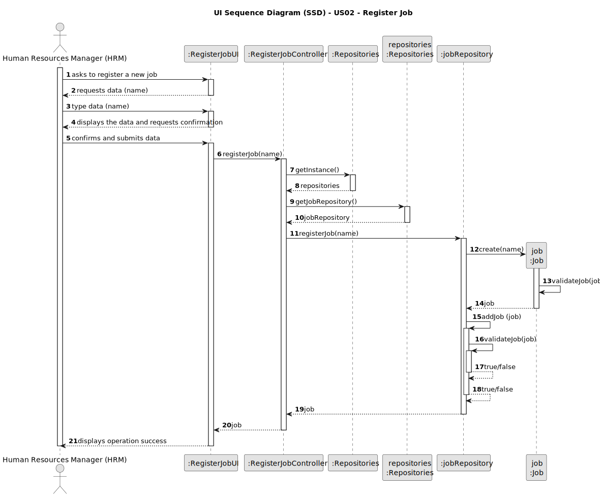
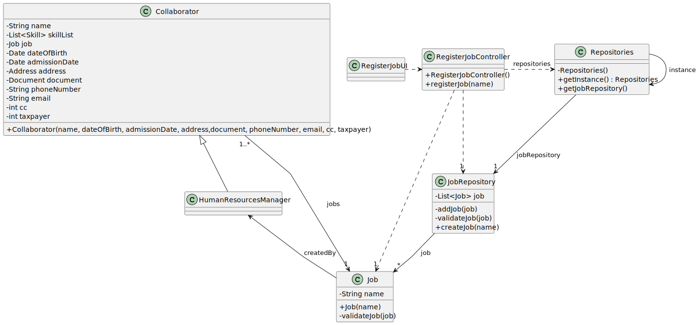

# US02 - Register a job.

## 3. Design - User Story Realization 

### 3.1. Rationale

| Interaction ID | Question: Which class is responsible for...   | Answer                | Justification (with patterns)                                                                                 |
|:---------------|:----------------------------------------------|:----------------------|:--------------------------------------------------------------------------------------------------------------|
| Step 1  		     | 	... interacting with the actor?              | RegisterJobUI         | Pure Fabrication: there is no reason to assign this responsibility to any existing class in the Domain Model. |
| 			  		        | 	... coordinating the US?                     | RegisterJobController | Controller                                                                                                    |
| 			  		        | 	... instantiating a new Job?                 | Collaborator          | Creator (Rule 1,2): in the DM Collaborator has a Job.                                                         |
| 			  		        | ... knowing the user using the system?        | UserSession           | IE: cf. A&A component documentation.                                                                          |
| 			  		        | 							                                       | Collaborator          | IE: knows its own data (e.g. name,dateOfBirth,admissionDate,address,phoneNumber,email,cc,cardNumber)          |
| 			  		        | 							                                       | JobRepository         | IE: knows its own data (e.g. job)                                                                             |
| Step 2  		     | 							                                       |                       |                                                                                                               |
| Step 3  		     | 	...saving the inputted data?                 | Job                   | IE: object created in step 1 has its own data.                                                                |
| Step 4  		     | 							                                       |                       |                                                                                                               |              
| Step 5  		     | 	... validating all data (local validation)?  | Job                   | IE: owns its data.                                                                                            | 
| 			  		        | 	... validating all data (global validation)? | JobRepository         | IE: knows all the jobs.                                                                                       | 
| 			  		        | 	... saving the created Job?                  | JobRepository         | IE: owns all the jobs.                                                                                        | 
| Step 6  		     | 	... informing operation success?             | RegisterJobUI         | IE: is responsible for user interactions.                                                                     | 

### Systematization ##

According to the taken rationale, the conceptual classes promoted to software classes are: 

* Job
* JobRepository

Other software classes (i.e. Pure Fabrication) identified: 

* RegisterJobUI  
* RegisterJobController

## 3.2. Sequence Diagram (SD)

### Full Diagram

This diagram shows the full sequence of interactions between the classes involved in the realization of this user story.

### Split Diagrams

n/a

## 3.3. Class Diagram (CD)

