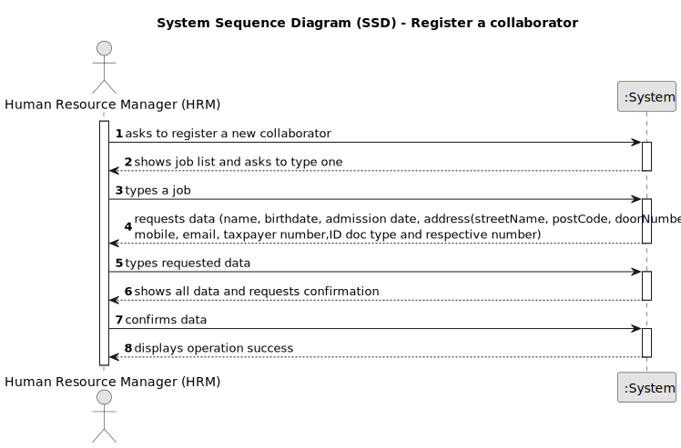

# US03 - Register a collaborator

## 1. Requirements Engineering

### 1.1. User Story Description

US03 - As a Human Resource Manager, I want to register a collaborator with a job and fundamental characteristics.

### 1.2. Customer Specifications and Clarifications

*From the specifications document:*

>Collaborator can only be registered by a Human Resources Manager (HRM).

*From the client clarifications:*

>**Question:** When creating a collaborator with an existing name ... What the system do?
>
>What characteristics are important to success the register?
>
>**Answer:** It's not common and most improbable to have different individual with same name in the same context, however it’s ID documentation number should be unique for sure.
>
>I believe that question was already answered, name, birthdate, admission date, id doc type, id doc number, contact info (email, mobile), address.

>**Question:** Should the system able the HRM to insert multiple collaborators in one interaction before saving them?
>
>**Answer:** it's not required to do so.

>**Question:** I have some questions regarding the business rules of this US:
>
> Is there any limitation regarding the length of the name of the collaborator?
>
> Should we consider valid only the birthdates in which the collaborator has more than 18 years?
>
> What should be the format for the phone number? 9 numbers?
>
> What is the format for the numbers from the id doc types?
>
>Are there any other business rules?
>
>**Answer:** According to the Portuguese law a name should contain at maximum six words;
>
> yes;
>
> validating 9 digits will be acceptable; validating with international format would be excelent;
>
> each doc type has specific formats like taxpayer number, Citizen Card ou passport.

> **Question:** Na User Story 03 é mencionado o termo 'características fundamentais'. A minha questão é, precisamente,
> quais são estas características.
>
>**Answer:** os dados essenciais do colaborador mínimos serão nome, data de nascimento, data de admissão, morada,
> contacto (telefonico e email), documento de identificação e o seu número. Podem considerar outros que entendam ser
> relevantes.

> **Question:**
>1. Esse número tem algum formato em particular?
>2. Como é que é suposto esse ser criado? Automaticamente pelo sistema ou manualmente pelo HRM?
>
>**Answer:** Não faz sentido gerar um número que representa a identificação de uma pessoa. As pessoas têm documentos de
> identificação (CC, BI, Passaporte) cujos números já foram atribuidos.

> **Question:**
> What is needed for the adress ? Street, zipcode and a city?
>
>**Answer:** That would be enough.

> **Question:**
> What should be the accepted format for the emails? Should only specific email services be accepted?
>
>**Answer:** A valid email address consists of an email prefix and an email domain, both in acceptable formats.
> The prefix appears to the left of the @ symbol. The domain appears to the right of the @ symbol.
> For example, in the address example@mail.com, "example" is the email prefix, and "mail.com" is the email domain.

> **Question:**
> When registering a new collaborator, should the system keep the information about the manager who registered that
> collaborator? (example: Collaborator "X" was registered by HRM "Y")
>
>**Answer:** No information for later auditing is for now required.

> **Question:**
> What would be examples of valid taxpayer and citizen card numbers?
>
>**Answer:** Portuguese rules for both; I suppose you can find them easily on the web.

> **Question:**
> I have some questions about the US03:
> Question:** Which information is mandatory to insert a collaborator in the program (fundamental characteristics)?
> Question:** Does the HRM select the job from a list that we display?
>
> **Answer:** - name, birth date, admission date, address, contact info (mobile and email), taxpayer number, ID doc type
> and respective number - displaying or not, It's a matter of UX, the dev team should decide about it, but the valid
> jobs
> are the ones created within the US02.

### 1.3. Acceptance Criteria

* *AC1:* Name, birthdate, admission date, address, contact info (mobile and email), ID doc type and respective number should be provided by HRM.
* *AC2:* All required fields must be filled in.
* *AC3:* Name can have 6 words maximum.
* *AC4:* Dates must follow this format: yyyy-mm-dd.
* *AC5:* Need to certify that the collaborator has at least 18 years of age.
* *AC6:* Phone number needs to use this format: +999(max 3 numbers) 999999999
* *AC7:* ID documentation number should be unique.
* *AC8:* Email have a specific format example@mail.com, "example" is the email prefix, and "mail.com" is the email
  domain.
* *AC9:* Taxpayer and cc needs to use portuguese rules

* ### 1.4. Found out Dependencies

* There is a dependency on "US02 - Register a job" as there must be at least one job to register a collaborator.

### 1.5 Input and Output Data

*Input Data:*

* Typed data:
  * a name
  * a birthdate
  * an admission date
  * an address
  * a mobile phone number
  * an email
  * a taxpayer identification number
  * an id doc type
  * an id doc number
  * a job (name)

*Output Data:*
* (In)Success of the operation

### 1.6. System Sequence Diagram (SSD)

### 1.7 Other Relevant Remarks

* N/A.