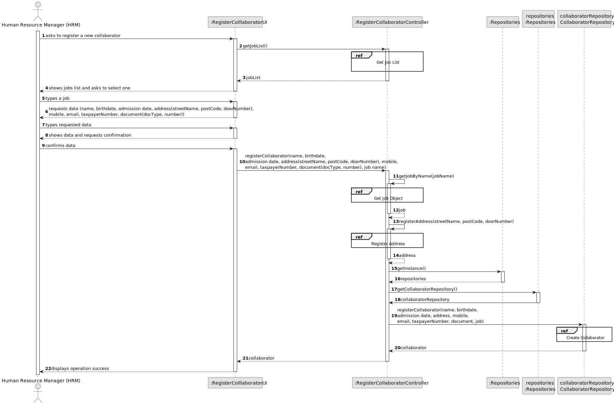
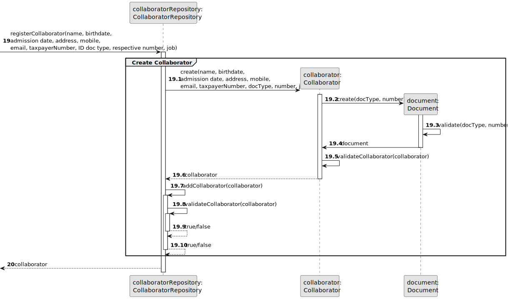

# US03 - Register a collaborator.

## 3. Design - User Story Realization 

### 3.1. Rationale

_**Note that SSD - Alternative One is adopted.**_

| Interaction ID | Question: Which class is responsible for...   | Answer                         | Justification (with patterns)                                                                                 |
|:---------------|:----------------------------------------------|:-------------------------------|:--------------------------------------------------------------------------------------------------------------|
| Step 1  		     | 	... interacting with the actor?              | RegisterCollaboratorUI         | Pure Fabrication: there is no reason to assign this responsibility to any existing class in the Domain Model. |
| 			  		        | 	... coordinating the US?                     | RegisterCollaboratorController | Controller                                                                                                    |
| 			  		        | 	... instantiating a new Collaborator?        | CollaboratorRepository         | Pure Fabrication: they form a collection of objects that do not “belong” to any domain object/class           |
| Step 2  		 | 							                                       |                                |                                                                                                               |
| Step 3  		 | 	...saving the inputted data?                 | Collaborator                   | IE: object created in step 1 has its own data.                                                                |
| Step 4  		 | 	...knowing the job list to show?             | System                         | IE: Jobs are defined by the Administrators.                                                                   |
| Step 5  		 | 	... saving the selected job?                 | Collaborator                   | IE: object created in step 1 is classified in one Category.                                                   |
| Step 6  		 | 							                                       |                                |                                                                                                               |              
| Step 7  		 | 	... validating all data (local validation)?  | Collaborator                   | IE: owns its data.                                                                                            | 
| 			  		 | 	... validating all data (global validation)? | CollaboratorRepository         | IE: knows all its collaborators.                                                                                      | 
| 			  		 | 	... saving the created Collaborator?         | CollaboratorRepository                   | IE: owns all its collaborators.                                                                               | 
| Step 8  		 | 	... informing operation success?             | RegisterCollaboratorUI                   | IE: is responsible for user interactions.                                                                     | 

### Systematization ##

According to the taken rationale, the conceptual classes promoted to software classes are: 

* Collaborator
* Job
* Address

Other software classes (i.e. Pure Fabrication) identified: 

* RegisterCollaboratorUI  
* RegisterCollaboratorController
* CollaboratorRepository
* JobRepository
* AddressRepository

## 3.2. Sequence Diagram (SD)

_**Note that SSD - Alternative Two is adopted.**_

### Full Diagram

This diagram shows the full sequence of interactions between the classes involved in the realization of this user story.

### Split Diagrams

The following diagram shows the same sequence of interactions between the classes involved in the realization of this user story, but it is split in partial diagrams to better illustrate the interactions between the classes.

It uses Interaction Occurrence (a.k.a. Interaction Use).

**Get Job List Partial SD**

**Get Job Object**

**Register Address**

**Create Document Object and Collaborator**

## 3.3. Class Diagram (CD)

