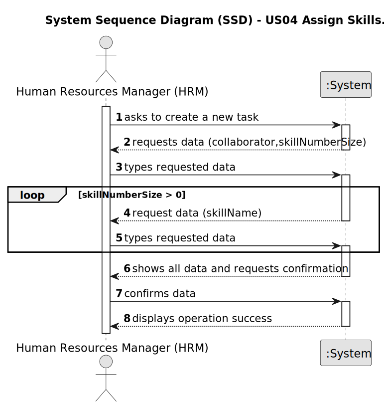

# US04 - Assign Skills.

## 1. Requirements Engineering

### 1.1. User Story Description

As an HRM, I want to assign one or more skills to a collaborator.

### 1.2. Customer Specifications and Clarifications 

**From the specifications document:**

>	An employee can have one or more skills 

**From the client clarifications:**

> **Question:** Na US04 é relativa à associação de skills a um colaborador. A minha questão é: 1. se há um número mínimo e máximo de número de skills; 2. se há alguma característica especial que seja necessária o colaborar ter para que lhe sejam adicionadas estas skills.
>
> **Answer:** 1. Não; 2. Não.
   

> **Question:** Good evening, Regarding registering a skill, we have a couple of questions: - Can any skill be registered to any collaborator/job? Or should they be associated in categories in association with a specific job - Should it be possible to add the same skill to a collaborator multiple times? - Is there any certification/proof needed to register a skill to a colaborator?

> **Answer:**
-There is no association, it totally depends of the CV of the collaborator.
-That does not make sense
-no.
>
> **Question:** US04

>1- Can multiple skills be assigned to a collaborator simultaneously?

>- Is there any limit to the number of skills that can be assigned to a collaborator?

> **Answer:** us04
> 
>1.yes; already answered;
> 
>2.no

### 1.3. Acceptance Criteria

* **AC1:** Need to be an employee of the organization.  
* **AC2:** Carries out design, construction and/or maintenance tasks for green areas, depending on their skills.
* **AC3:** All required fields must be filled in.

### 1.4. Found out Dependencies

* There is a dependency on "US03 - As an HRM, I want to register a collaborator with a job and fundamental
  characteristics." as there must be at least one collaborator to assign one or more skills to a collaborator.

### 1.5 Input and Output Data

**Input Data:**

* Typed data:
    * collaborator
    * skillNumberSize
    * skillsName 

**Output Data:**

* Show the collaborator with skills added successful

### 1.6. System Sequence Diagram (SSD)

### 1.7 Other Relevant Remarks

n/a