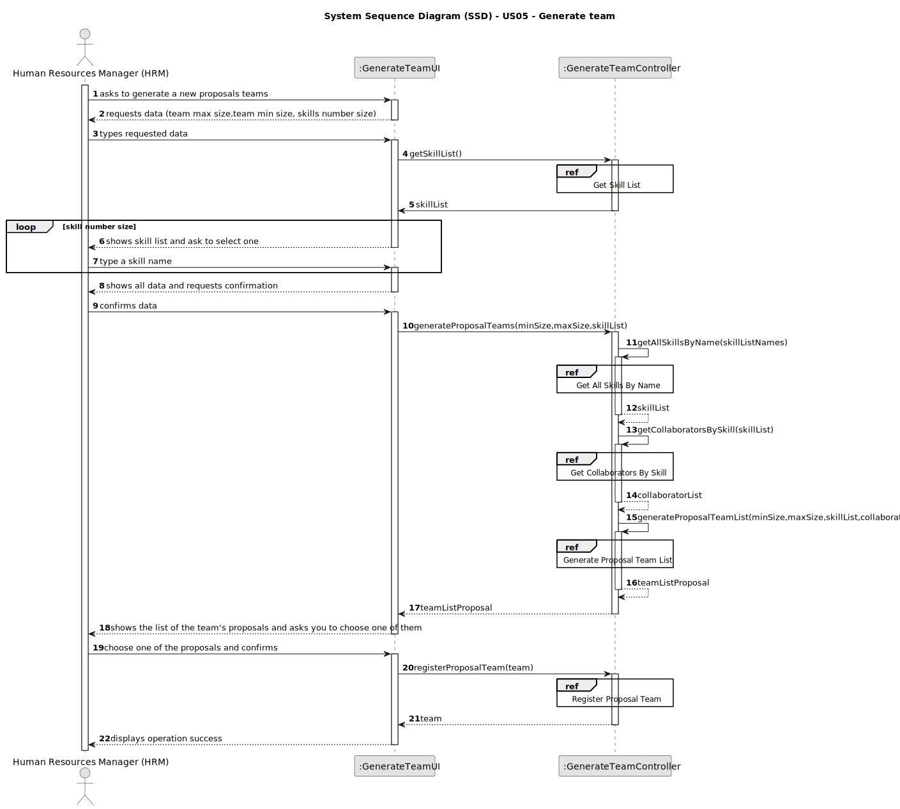
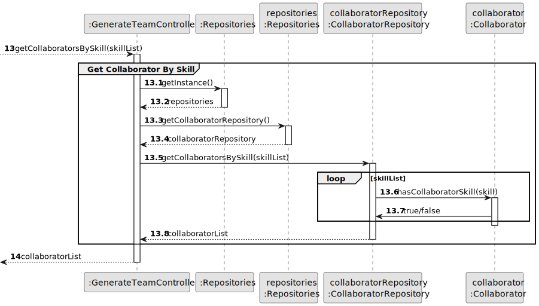
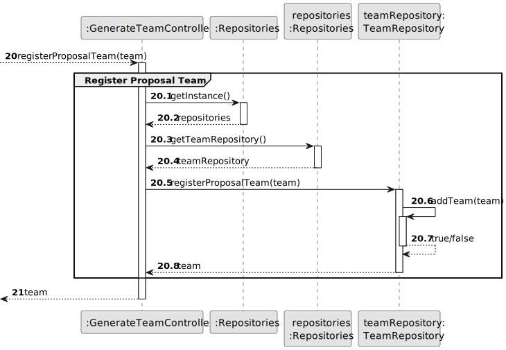
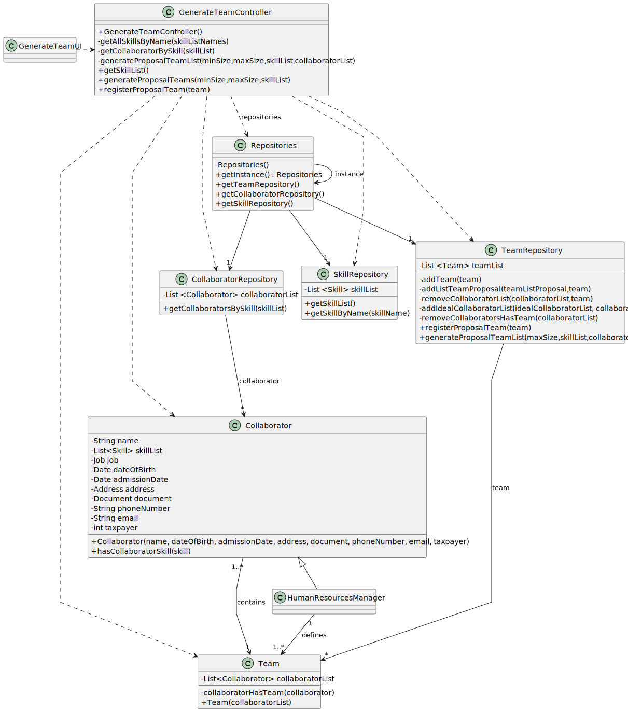

# US05 - Generate Team.

## 3. Design - User Story Realization 

### 3.1. Rationale

| Interaction ID | Question: Which class is responsible for...         | Answer                 | Justification (with patterns)                                                                                 |
|:---------------|:----------------------------------------------------|:-----------------------|:--------------------------------------------------------------------------------------------------------------|
| Step 1  		     | 	... interacting with the actor?                    | GenerateTeamUI         | Pure Fabrication: there is no reason to assign this responsibility to any existing class in the Domain Model. |
| 			  		        | 	... coordinating the US?                           | GenerateTeamController | Controller                                                                                                    |
| 			  		        | 	... instantiating a new Team?                      | TeamRepository         | Pure Fabrication: they form a collection of objects that do not “belong” to any domain object/class.          |
| 			  		        | 							                                             | TeamRepository         | IE: knows/has its own Team                                                                                    |
| 			  		        | 							                                             | Team                   | IE: knows its own data (e.g. Collaborators)                                                                   |
| 			  		        | 							                                             | CollaboratorRepository | IE: knows/has its own Collaborator                                                                            |
| 			  		        | 							                                             | Collaborator           | IE: knows its own data (e.g. name,...)                                                                        |
| 			  		        | 							                                             | SkillRepository        | IE: knows/has its own Skill                                                                                   |
| 			  		        | 							                                             | Skill                  | IE: knows/has its own data (e.g name)                                                                         |
| Step 2         |                                                     |                        |
| Step 3         |                                                     |                        |
| Step 4         |                                                     |                        |
| Step 5  		     | 	... validating all Skill data (global validation)? | SkillRepository        | IE: knows all its skills.                                                                                     |
| Step 6  		     | 							                                             |                        |                                                                                                               |              
| Step 7  		     | 	... validating all Team data (global validation)?  | Team                   | IE: knows all its team.                                                                                       | 
| Step 8  		     | 	... show teams proposals?                          | GenerateTeamUI         | IE: is responsible for user interactions.                                                                     | 
| Step 9  		     | 	... save input choice?                             | Team                   | IE: Object created in step 1 has its own data.                                                                | 
| 			  		        | 	... saving the created team?                       | TeamRepository         | IE: owns all the teams.                                                                                       | 
| Step 10        | ... informing operation success?                    | GenerateTeamUI         | IE: is responsible for user interactions.                                                                     |

### Systematization ##

According to the taken rationale, the conceptual classes promoted to software classes are: 

* Team
* Skill
* Collaborator

Other software classes (i.e. Pure Fabrication) identified: 

* GenerateTeamUI
* GenerateTeamController
* TeamRepository
* SkillRepository
* CollaboratorRepository

## 3.2. Sequence Diagram (SD)

### Full Diagram

This diagram shows the full sequence of interactions between the classes involved in the realization of this user story.

### Split Diagrams

The following diagram shows the same sequence of interactions between the classes involved in the realization of this user story, but it is split in partial diagrams to better illustrate the interactions between the classes.

It uses Interaction Occurrence (a.k.a. Interaction Use).

**Has Skill By Name**

**Get Collaborator By Skill**

**Register Proposal Team**

## 3.3. Class Diagram (CD)

