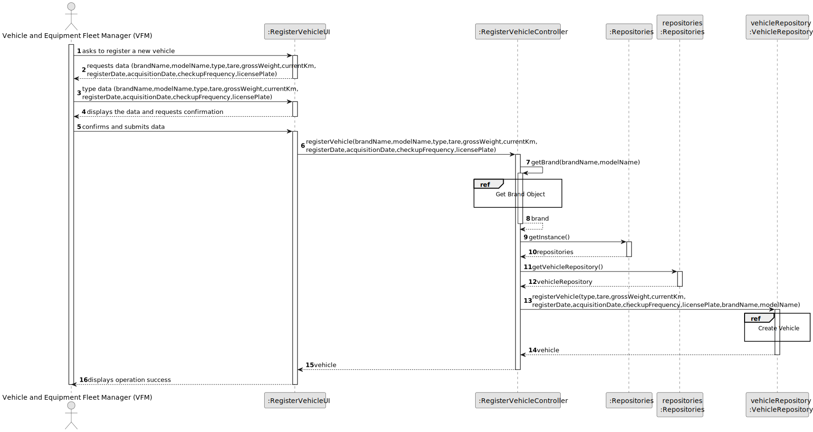
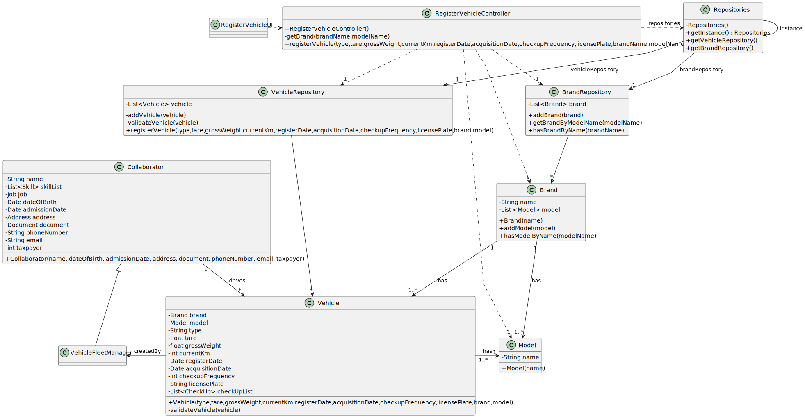

# US06 - Register a vehicle.

## 3. Design - User Story Realization

### 3.1. Rationale

| Interaction ID | Question: Which class is responsible for...           | Answer                    | Justification (with patterns)                                                                                 |
|:---------------|:------------------------------------------------------|:--------------------------|:--------------------------------------------------------------------------------------------------------------|
| Step 1  		     | 	... interacting with the actor?                      | RegisterVehicleUI         | Pure Fabrication: there is no reason to assign this responsibility to any existing class in the Domain Model. |
| 			  		        | 	... coordinating the US?                             | RegisterVehicleController | Controller                                                                                                    |
| 			  		        | 	... instantiating a new Vehicle?                     | VehicleRepository         | Pure Fabrication: they form a collection of objects that do not “belong” to any domain object/class           |
| 			  		        | 	... instantiating a new Brand?                       | BrandRepository           | Pure Fabrication: they form a collection of objects that do not “belong” to any domain object/class           |
| 			  		        | 	... instantiating a new Model?                       | Brand                     | Creator: Brand contains or aggregates instances of Model and Brand records instances of Model                 |
| 			  		        | 							                                               | VehicleRepository         | IE: knows/has its own Vehicle.                                                                                |
| 			  		        | 							                                               | BrandRepository           | IE: knows/has its own Brand.                                                                                  |
| 			  		        | 							                                               | Brand                     | IE: knows/has its own Model.                                                                                  |
| 			  		        | 							                                               | Brand                     | IE: knows its own data (e.g. name)                                                                            |
| 			  		        | 							                                               | Model                     | IE: knows its own data (e.g. name)                                                                            |
| 			  		        | 							                                               | Vehicle                   | IE: knows its own data (e.g. type)                                                                            |
| Step 2	  		    | 							                                               |                           |                                                                                                               |
| Step 3  		     | 	...saving the inputted data?                         | Vehicle                   | IE: object created in step 1 has its own data.                                                                |
| Step 4	  		    | 							                                               |                           |                                                                                                               |
| Step 5  		     | 	... validating all Brand data (local validation)?    | Brand                     | IE: owns its data.                                                                                            | 
| 		             | 	... validating all Model data (local validation)?    | Model                     | IE: owns its data.                                                                                            | 
| 		             | 	... validating all Vehicle data (local validation)?  | Vehicle                   | IE: owns its data.                                                                                            |
| 			  		        | 	... validating all Model data (global validation)?   | Brand                     | IE: knows all the models.                                                                                     |
| 			  		        | 	... validating all Brand data (global validation)?   | BrandRepository           | IE: knows all the brands.                                                                                     |
| 			  		        | 	... validating all Vehicle data (global validation)? | VehicleRepository         | IE: knows all the vehicles.                                                                                   | 
| 			  		        | 	... saving the created Brand?                        | BrandRepository           | IE: owns all the brands.                                                                                      | 
| 			  		        | 	... saving the created Model?                        | Brand                     | IE: owns all the models.                                                                                      |
| 			  		        | 	... saving the created Vehicle?                      | VehicleRepository         | IE: owns all the vehicles.                                                                                    | 
| Step 6  		     | 	... informing operation success?                     | RegisterVehicleUI         | IE: is responsible for user interactions.                                                                     | 

### Systematization ##

According to the taken rationale, the conceptual classes promoted to software classes are:

* Brand
* Model
* Vehicle

Other software classes (i.e. Pure Fabrication) identified:

* RegisterVehicleUI
* RegisterVehicleController
* VehicleRepository
* BrandRepository

## 3.2. Sequence Diagram (SD)

### Full Diagram

This diagram shows the full sequence of interactions between the classes involved in the realization of this user story.

### Split Diagrams

The following diagram shows the same sequence of interactions between the classes involved in the realization of this user story, but it is split in partial diagrams to better illustrate the interactions between the classes.

It uses Interaction Occurrence (a.k.a. Interaction Use).

**Create Brand**

**Create Model**

**Create Vehicle**

## 3.3. Class Diagram (CD)

