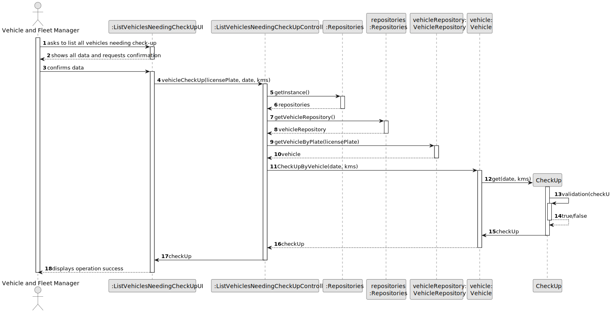
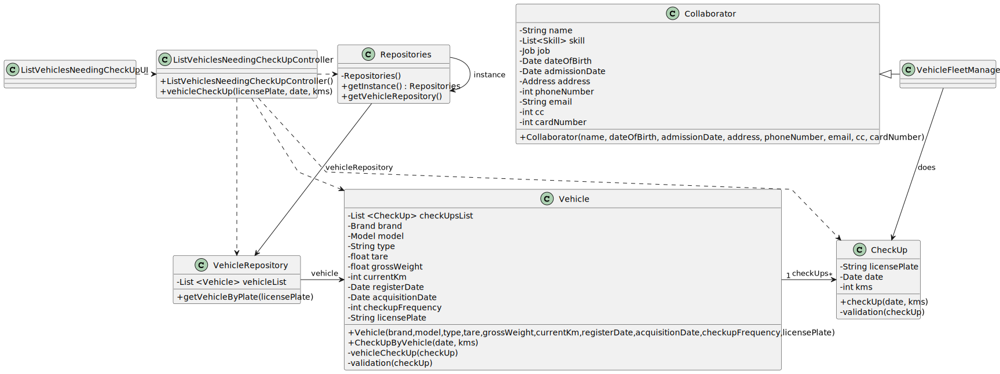

# US08 - As an FM, I want to list the vehicles needing the check-up.

## 3. Design - User Story Realization

### 3.1. Rationale

| Interaction ID | Question: Which class is responsible for... | Answer                    | Justification (with patterns)                                                                                 |
|:---------------|:--------------------------------------------|:--------------------------|:--------------------------------------------------------------------------------------------------------------|
| Step 1  		     | 	... interacting with the actor?            | ListVehiclesNeedingCheckUpUI                     | Pure Fabrication: there is no reason to assign this responsibility to any existing class in the Domain Model. |
| 			  		        | 	... coordinating the US?                   | ListVehiclesNeedingCheckUpController | Controller                                                                                                    |
| 			  		        | 	... instantiating a new CheckUp?           | Vehicle                   | Creator: Vehicle contains or aggregates instances of CheckUp and Vehicle records instances of CheckUp.        |
| 			  		        | 							                                     | Vehicle                   | IE: knows/has its own CheckUps                                                                                |
| 			  		        | 							                                     | CheckUp                   | IE: knows its own data (e.g. data, kms)                                                                       |
| Step 2  		     | 							                                     |                           |                                                                                                               |
| Step 3  		     | 	...saving the inputted data?               | CheckUp                   | IE: object created in step 1 has its own data.                                                                |
| Step 4  		     | 	                                           |                           |                                                                                                               |
| Step 5  		     | 	... saving the created checkUp?            | Vehicle                   | IE: object created in step 1 owns all checkUps.                                                               |
| Step 6  		     | 	...	informing operation success?					      | ListVehiclesNeedingCheckUpUI         | IE: is responsible for user interactions.                                                                     |

### Systematization ##

According to the taken rationale, the conceptual classes promoted to software classes are:

* CheckUp
* Vehicle

Other software classes (i.e. Pure Fabrication) identified:

* ListVehiclesNeedingCheckUpUI
* ListVehiclesNeedingCheckUpController
* VehicleRepository

## 3.2. Sequence Diagram (SD)

### Full Diagram

This diagram shows the full sequence of interactions between the classes involved in the realization of this user story.

### Split Diagrams

n/a

## 3.3. Class Diagram (CD)

