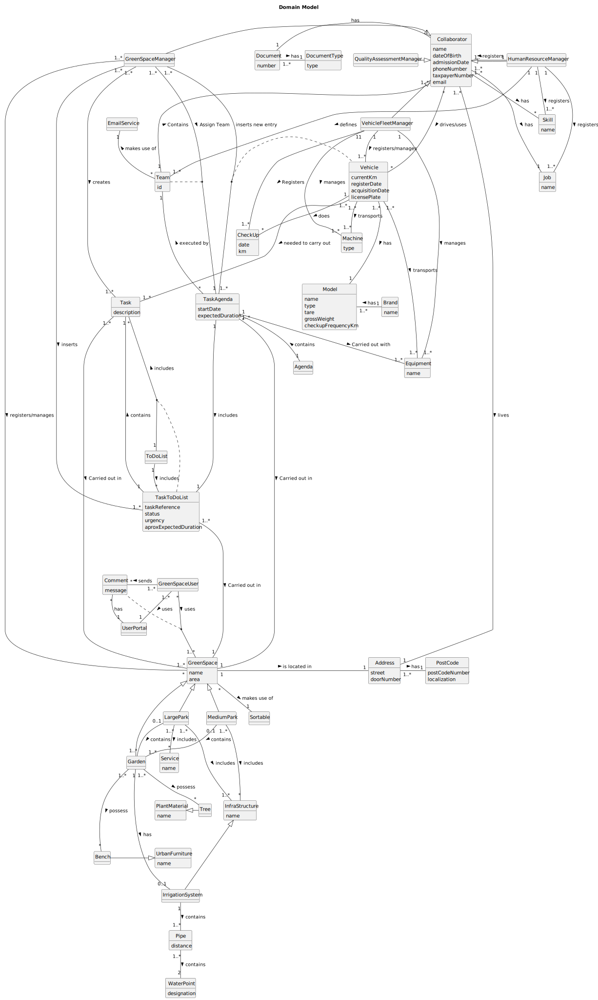

# OO Analysis

The construction process of the domain model is based on the client specifications, especially the nouns (for
_concepts_) and verbs (for _relations_) used.

## Rationale to identify domain conceptual classes

To identify domain conceptual classes, start by making a list of candidate conceptual classes inspired by the list of
categories suggested in the book "Applying UML and Patterns: An Introduction to Object-Oriented Analysis and Design and
Iterative Development".

### _Conceptual Class Category List_

**Business Transactions**

* Skills
* Vehicles
* Job
* Collaborator
* Team
* Check-up
* Pipe
* WaterPoint
* IrrigationSystem
* Document
* Agenda
* ToDoList

---

**Transaction Line Items**

* Skills
* Vehicles
* WaterPoint
* Pipe
* Task

---

**Product/Service related to a Transaction or Transaction Line Item**

* Check-up

---

**Transaction Records**

* Collaborator
* Skills
* Job
* Vehicles
* Document

---  

**Roles of People or Organizations**

* Collaborator
* (HRM) Human Resources Manager
* (VFM) Vehicle and Equipment Fleet Manager
* (GSM) Green Spaces Manager
* (GSU) Green Spaces User
* (QAM) Software Quality Assessment Team Manager
* Green Space User

---

**Places**

* Garden
* Medium-sized park
* Large-sized par

---

**Noteworthy Events**

*

---

**Physical Objects**

* Vehicles
* Machines
* Equipments
* UrbanFurniture
* PlantMaterial
* InfraStructure

---

**Descriptions of Things**

*

---

**Catalogs**

*

---

**Containers**

* GreenSpace
* Agenda
* ToDoList
* Team
* Collaborator

---

**Elements of Containers**

* Infrastructure
* Wooded garden area
* Equipment
* Service
* Task
* Collaborator
* Skill

---

**Organizations**

* MusgoSublime (MS)

---

**Other External/Collaborating Systems**

* Authentication System

---

**Records of finance, work, contracts, legal matters**

*

---

**Financial Instruments**

*

---

**Documents mentioned/used to perform some work/**

* Agenda
* ToDoList
* Check-up
* Document

---

## Rationale to identify associations between conceptual classes

An association is a relationship between instances of objects that indicates a relevant connection and that is worth of
remembering, or it is derivable from the List of Common Associations:

| Concept (A) 	           |      Association       |              Concept (B) |
|-------------------------|:----------------------:|-------------------------:|
| Address  	              |         has 	          |                 PostCode |
| Agenda  	               |       contains 	       |               TaskAgenda |
| Brand                   |          Has           |                    Model |
| Collaborator            |     Generalization     | QualityAssessmentManager |
| Collaborator            |     Generalization     |     HumanResourceManager |
| Collaborator            |     Generalization     |      VehicleFleetManager |
| Collaborator            |     Generalization     |        GreenSpaceManager |
| Collaborator            |         Lives          |                  Address |
| Collaborator  	         |    Drives/Uses    	    |                  Vehicle |
| Collaborator  	         |         Has  	         |                 Document |
| Collaborator            |          Has	          |                      Job |
| Collaborator  	         |        Has   	         |                    Skill |
| Collaborator  	         |         Has  	         |                 Document |
| Document  	             |         Has  	         |             DocumentType |
| Garden  	               |         Has  	         |         IrrigationSystem |
| Garden  	               |       possess  	       |                     Tree |
| Garden  	               |       possess  	       |                    Bench |
| GreenSpace              |     Generalization     |               MediumPark |
| GreenSpace              |     Generalization     |                   Garden |
| GreenSpace              |     Generalization     |                LargePark |
| GreenSpace  	           |    is located in  	    |                  Address |
| GreenSpace  	           |    makes use of  	     |                 Sortable |
| GreenSpaceManager  	    |  registers/manages  	  |               GreenSpace |
| GreenSpaceManager  	    |       creates  	       |                     Task |
| GreenSpaceManager  	    |       inserts  	       |             TaskToDoList |
| GreenSpaceManager  	    |  inserts new entry  	  |               TaskAgenda |
| GreenSpaceManager  	    |     Assign Team  	     |               TaskAgenda |
| GreenSpaceUser  	       |        uses   	        |               GreenSpace |
| GreenSpaceUser  	       |        sends  	        |                  Comment |
| GreenSpaceUser  	       |        uses  	         |               UserPortal |
| HumanResourceManager  	 |     registers   	      |             Collaborator |
| HumanResourceManager  	 |      registers  	      |                      Job |
| HumanResourceManager  	 |      registers  	      |                    Skill |
| HumanResourceManager  	 |       defines  	       |                     Team |
| InfraStructure  	       |   Generalization  	    |         IrrigationSystem |
| IrrigationSystem  	     |      contains  	       |                     Pipe |
| LargePark  	            |      includes  	       |           InfraStructure |
| LargePark  	            |      includes  	       |                  Service |
| LargePark  	            |      contains  	       |                   Garden |
| MediumPark  	           |      includes  	       |           InfraStructure |
| MediumPark  	           |      contains  	       |                   Garden |
| Pipe  	                 |      contains  	       |               WaterPoint |
| PlantMaterial  	        |   Generalization  	    |                     Tree |
| Task  	                 |   Carried out in  	    |               GreenSpace |
| TaskAgenda  	           |   Carried out in  	    |               GreenSpace |
| TaskAgenda  	           |   Carried out with 	   |                Equipment |
| TaskAgenda  	           |       includes 	       |             TaskToDoList |
| TaskAgenda  	           |    executed by    	    |                     Team |
| TaskToDoList  	         |    Carried out in 	    |               GreenSpace |
| TaskToDoList  	         |       contains 	       |                     Task |
| Team  	                 |     Contains    	      |             Collaborator |
| Team  	                 |   makes use of    	    |             EmailService |
| ToDoList  	             |      includes  	       |                     Task |
| ToDoList  	             |      includes  	       |             TaskToDoList |
| UrbanFurniture  	       |   Generalization  	    |                    Bench |
| UserPortal  	           |         has  	         |                  Comment |
| Vehicle  	              | needed to carry out  	 |                     Task |
| Vehicle  	              |     transports  	      |                  Machine |
| Vehicle  	              |     transports  	      |                Equipment |
| Vehicle  	              |         has  	         |                    Model |
| Vehicle  	              |        does  	         |                  CheckUp |
| VehicleFleetManager  	  |      manages   	       |                  Machine |
| VehicleFleetManager  	  |       manages  	       |                Equipment |
| VehicleFleetManager  	  |  registers/manages  	  |                  Vehicle |
| VehicleFleetManager  	  |      Registers  	      |                  CheckUp |

## Domain Model

**Do NOT forget to identify concept atributes too.**

**Insert below the Domain Model Diagram in a SVG format**

