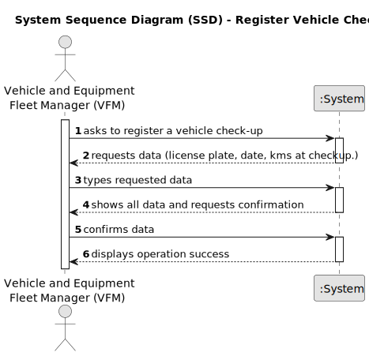

# US07 - Register vehicle check-up.

## 1. Requirements Engineering

### 1.1. User Story Description

US07 - As a Vehicle and Equipment Fleet Manager, I want to register a vehicle’s check-up.

### 1.2. Customer Specifications and Clarifications

**From the specifications document:**
>Vehicle check-up can only be registered by a Human Resources Manager (VFM).

**From the client clarifications:**

> **Question:** Can a vehicle have more than one check-up?
>
> **Answer:** Yes.

> **Question:** What is the unit of measurement used to estimate the check-up frequency (Kms, months, etc.)?
>
> **Answer:** In real context all could be considered, in the scope of this project just kms will be considered.

> **Question:** Which attributes will you need for the vehicle's check-up?
>
> **Answer:** Plate number, date, kms at checkup.

> **Question:** after registering a vehicle, should the vehicle info appear or only the (in)success of the operation
>
> **Answer:** The UX/UI is up to dev team.

> **Question:** Does a vehicle need to be registered in US06 before being able to go for a check up in US07?
>
> **Answer:** yes.

> **Question:** What´s the supposed vehicle check up supposed to look like?
>
> **Answer:** while registering a checkup, the vehicle id, date and current kms, shoud be considered.

> **Question:** can a vehicle not have a check up?
>
> **Answer:** Yes;

> **Question:** The date and current Kms that are needed on the check up is the same date and Kms of the vehicle or are
> the date and Kms of the day that the check up was created?
>
> **Answer:** The date and current kms of the checkup.

### 1.3. Acceptance Criteria

* **AC1:** All required fields must be filled in.
* **AC2:** KM must be a number greater than zero.
* **AC3:** Date must follow this format: yyyy-mm-dd.

### 1.4. Found out Dependencies

* There is a dependency on "US006 - Register vehicle" as there must be at least one vehicle to be able to do a check-up.

### 1.5 Input and Output Data

**Input Data:**

* Typed data:
  * a license plate
  * a date
  * the km at checkup

**Output Data:**

* (In)Success of the operation

### 1.6. System Sequence Diagram (SSD)

### 1.7 Other Relevant Remarks

* N/A