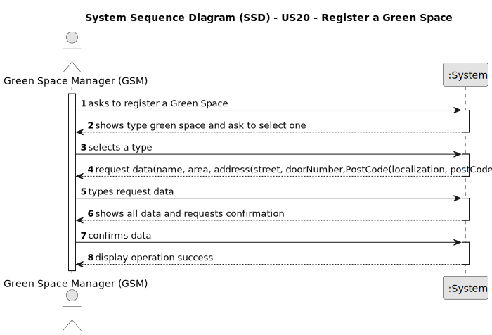

# US20 - Register a Green Space

## 1. Requirements Engineering

### 1.1. User Story Description

As a Green Space Manager (GSM), I want to register a green space (garden, medium-sized park or large-sized park) and its
respective area.

### 1.2. Customer Specifications and Clarifications

**From the specifications document:**

> Green spaces for collective use can vary significantly in dimensions and
> available amenities. They may range from small landscaped areas, parks
> with trees and some amenities like benches or playgrounds, to parks with
> multiple hectares (e.g., in Porto, there are the Parque da Cidade - City Park the Parque Oriental - the Oriental
> Park),
> wooded areas, lakes, and various facilities and installations.

> The green spaces for collective use managed by MS can significantly vary in
> size and installed equipment:
> - Garden - garden space with or without trees with little or no equipment
    (may have a basic irrigation system or/and benches);
>- Medium-sized park - green space with a few hundred or thousands of
   > square meters with a wooded garden area, it includes some infrastructures such as toilets, drinking fountains,
   > irrigation system, lighting,
   > children’s playground (for example, Quinta do Covelo, Jardim d’Arca
   > de Agua ´ );
>- Large-sized park - multi-function space with diverse garden spaces, and
   > woods, including varied equipment and services (for example, Parque
   > da Cidade).

**From the client clarifications:**

> **Question:**
>1. Should the green space have any more traits, other than the type of green space and area?
>2. In which unit should the area be measured in?
>3. Can the GSM register multiple green spaces at once?
>
> **Answer:**
>1. Already answered in the forum and client session.
>2. Usually, areas are measured in hectares.
>3. That's a matter of UX/UI, each dev team can decide about it.

> **Question:**
>   Our team is unsure about what the exact inputs for the Green Space, To-Do List Entry, and Agenda entry exactly
> are.
>   We understand that type (garden, medium-size, large-size), area, name, and address are required inputs for a
> Green
> Space (and if we are wrong in this, please correct us), but are there any other inputs that we are unaware of?
>   And when it comes to To-Do List entries, we identified a state (planned, postponed, completed, canceled), a
> green
> space,
> a title, and a description as inputs for a To-Do List entry. But are there any more? We also know that an Agenda
> entry
> has a target date, but is this target date supposed to be inputted upon transferring a task from the to-do list to
> the
> agenda, or is it supposed to be inputted upon creating the task in the to-do list?
>   Finally, during the last client meeting, we became aware that some tasks are meant to be reoccurring rather
> than
> occasional. Is this something that should be asked on creating the task in the to-do list? If so, what inputs should
> we
> expect from the user? The task's frequency in days?
>
> **Answer:**
>   Our team is unsure about what the exact inputs for the Green Space, To-Do List Entry, and Agenda entry exactly
> are.
>   We understand that type (garden, medium-size, large-size), area, name, and address are required inputs for a
> Green
> Space (and if we are wrong in this, please correct us), but are there any other inputs that we are unaware of?
>   <b>Seems enough</b>.
>   And when it comes to To-Do List entries, we identified a state (planned, postponed, completed, canceled), a
> green
> space,
> a title, and a description as inputs for a To-Do List entry. But are there any more?
>   <b>In the text you can find: the degree of urgency (High, Medium,and Low), and the approximate expected
> duration.</b>
>   We also know that an Agenda entry has a target date, but is this target date supposed to be inputted upon
> transferring a
> task from the to-do list to the agenda, or is it supposed to be inputted upon creating the task in the to-do list?
>   <b>To-do list entries doesn't have dates!</b>
>   Finally, during the last client meeting, we became aware that some tasks are meant to be reoccurring rather
> than
> occasional. Is this something that should be asked on creating the task in the to-do list? If so, what inputs should
> we
> expect from the user? The task's frequency in days?
>   <b>For the current proof-of-concept there is no need to distinguish between recurring and occasional
> tasks.</b>

> **Question:** To register a green space, what is the criteria needed to classify it as a medium-sized park or a
> large-sized park?
>
> **Answer:** It's a GSM responsability to decide the classification.

> **Question:** Can two green spaces have the same name?
>
> **Answer:** No.

> **Question:**  I would like to know between what ranges of hectares a green space is classified as garden, medium or
> large, or if it is possible to register 2 green spaces with the same area but in different typology, depending on the
> GSM it registers
>
> **Answer:** The classification is not automatic, it's up to GSM decide about it.

> **Question:** Can two different green spaces have the same address?
>
> **Answer:** No.

> **Question:** Boa tarde, se existem vários GSM quando um GSM cria um greenspace esse greenspace fica automaticamente
> associado a ele ou deve existir um menu em que um "administrador" geral da empresa escolhe a que cada greenspace cada
> GSM deve mandar?
>
> **Answer:** Não existem USs previstas para essa gestão.
> Por uma questão de simplicidade podem assumir que o GSM que cria o GS fica como gestor desse mesmo GS.

### 1.3. Acceptance Criteria

* **AC1:** All required fields must be filled in.
* **AC2:** Hectares must be an integer greater than zero.
* **AC3:** When creating a Green Space with an existing name or address, the system must reject such operation and the
  user must be
  able to modify the typed name or address.

### 1.4. Found out Dependencies

* n/a

### 1.5 Input and Output Data

**Input Data:**

* Typed data:
    * a type green space (e.g Garden,Medium-size Park and Large-size Park);
    * a name
    * a address(e.g streetName,postCode)
    * a area

**Output Data:**

* (In)Success of the operation

### 1.6. System Sequence Diagram (SSD)

### 1.7 Other Relevant Remarks

* The GSM when creating the green space is associated with it
* Area in Hectares