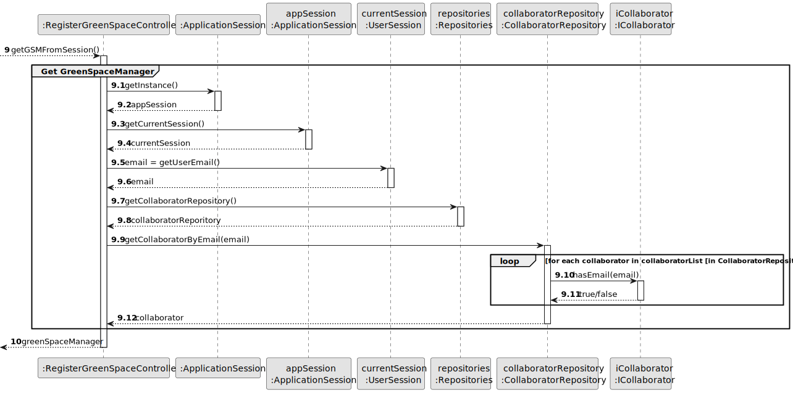
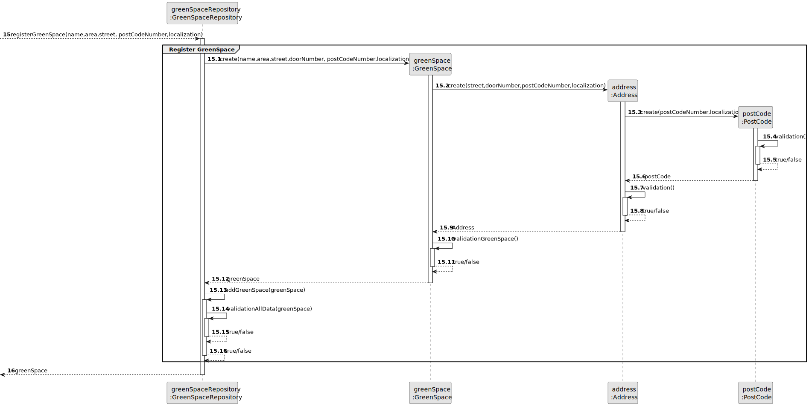
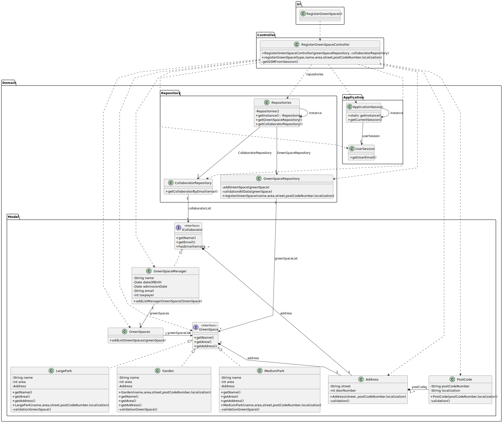

# US20 - Register a Green Space

## 3. Design - User Story Realization

### 3.1. Rationale

| Interaction ID | Question: Which class is responsible for...   | Answer                       | Justification (with patterns)                                                                                                                   |
|:---------------|:----------------------------------------------|:-----------------------------|:------------------------------------------------------------------------------------------------------------------------------------------------|
| Step 1  		     | 	... interacting with the actor?              | RegisterGreenSpaceUI         | Pure Fabrication: there is no reason to assign this responsibility to any existing class in the Domain Model.                                   |
| 			  		        | 	... coordinating the US?                     | RegisterGreenSpaceController | Pure Fabrication: Controller                                                                                                                    |
| 			  		        | 	... instantiating a new Green Space?         | GreenSpaceRepository         | Pure Fabrication: they form a collection of objects that do not “belong” to any domain object/class.                                            |
| 			  		        | ... knowing the user using the system?        | UserSession                  | IE: cf. A&A component documentation.                                                                                                            |
|                |                                               | CollaboratorRepository       | Pure Fabrication: they form a collection of objects that do not “belong” to any domain object/class. IE: knows/has its own Collaborator      |
| 			  		        | 							                                       | GreenSpaceRepository         | IE: knows/has its own Green Space                                                                                                               |
| 			  		        | 							                                       | GreenSpace                   | IE: knows its own data (e.g. name,address(street,postCode),area)                                                                            |
| 			  		        | 	... instantiating a new Address?             | GreenSpace                   | Creator:  (Rule 1): in the DM GreenSpace has a address.  (Rule 3) : GreenSpace uses Address to indicate its location (‘is located in’). |
| 			  		        | 							                                       | Address                      | IE: knows its own data (e.g. street)                                                                                                        |
|                | ... instantiating a new PostCode?             | Address                      | Creator:  (Rule 1): in the DM Address has a PostCode. (Rule 2) : Instances of Address record instances of PostCode.                     |          
|                |                                               | PostCode                     | IE: knows its own data (e.g. postCodeNumber,localization)                                                                                       |                                                                                               
| Step 2         | ...knowing the type greenSpace to show?       | System                       | IE: GreenSpace type are defined by the Administrators.                                                                                          |
| Step 3         | ... saving the selected type?                 | GreenSpace                   | IE: object created in step 1 is classified in one type.                                                                                         |
| Step 4         |                                               |                              |                                                                                                                                                 |
| Step 5  		     | 	...saving the inputted data?                 | GreenSpace                   | IE: object created in step 1 has its own data.                                                                                                  |
| Step 6         |                                               |                              |                                                                                                                                                 |
| Step 7  		     | 	...  postCode data (local validation)?       | PostCode                     | IE: owns its data.                                                                                                                              |
| 		             | 	...  address data (local validation)?        | Address                      | IE: owns its data.                                                                                                                              | 
|                | 	...  greenSpace data (local validation)?     | GreenSpace                   | IE: owns its data.                                                                                                                              |
| 			  		        | 	... validating all data (global validation)? | GreenSpaceRepository         | IE: knows all its GreenSpace.                                                                                                                   | 
| 			  		        | 	... saving the created Green Space?          | GreenSpaceRepository         | IE: owns all its GreenSpace.                                                                                                                    | 
| Step 8  		     | 	... informing operation success?             | RegisterGreenSpaceUI         | IE: is responsible for user interactions.                                                                                                       | 

### Systematization ##

According to the taken rationale, the conceptual classes promoted to software classes are:

* GreenSpace
* Address
* PostCode

Other software classes (i.e. Pure Fabrication) identified:

* RegisterGreenSpaceUI
* RegisterGreenSpaceController
* RegisterGreenSpaceRepository
* CollaboratorRepository

## 3.2. Sequence Diagram (SD)

### Full Diagram

This diagram shows the full sequence of interactions between the classes involved in the realization of this user story.

### Split Diagrams

Get Collaborator

Register GreenSpace

## 3.3. Class Diagram (CD)

