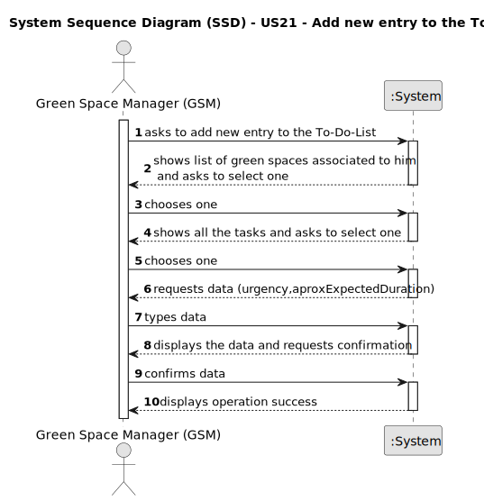

# US21 - Add new entry to the To-Do-List

## 1. Requirements Engineering

### 1.1. User Story Description

As a GSM, I want to add a new entry to the To-Do List.

### 1.2. Customer Specifications and Clarifications 

**From the specifications document:**

>The To-Do List comprises all the tasks required to
be done in order to assure the proper functioning of the parks.
>
> The To-Do List comprises all pending tasks for all parks. The entries in
this list describe the required task, the degree of urgency (High, Medium,
and Low), and the approximate expected duration.

**From the client clarifications:**

> **Question:** When a To-Do List entry is planned and moves to the Agenda, the status change from "Pending" to "Planned". Should this entry be removed from the To-Do List or just change status to "Planned" as it is on the Agenda?
>
> **Answer:** Changing the status in the To-Do list to Planned seems to be a good approach.

> **Question:** Is it mandatory for the program to have multiple GSM? If so, should each green space be associated with a responsible GSM? In other words, can only the GSM assigned to a specific green space register a new entry for the to-do list?
>
> **Answer:** The program can have multiple GSM.Yes.Yes.

> **Question:** When a to-do list entry is added to the agenda, what should its state be?
>
> **Answer:** Maybe "planned".

> **Question:** What time unit should be used for the duration of the task?
>
> **Answer:** Hour and/or days.

> **Question:** Hello. My question is how the code is supposed to know what GSM the user is? By an already logged in email? Or I have to make the machine ask for confirmation? Is the machine supposed to filter the green spaces the GSM manages in to avoid mistaking one for another?
>
> **Answer:** I have no knowledge about how to code!
>
>I suppose it's a matter of UX/UI, so each dev team can decide about it.

> **Question:** When a new entry is added to the ToDo list, the default status of that task will be "pending" or no status at all is considered on ToDo list?
>
>Similarly, when a new entry is added to the Agenda, the status of that task will be, by default, set to "planned", right?
>
> **Answer:** "Pending" as default for to-do list entries and "Planned" as default for Agenda entries, sounds good;

> **Question:** And when it comes to To-Do List entries, we identified a state (planned, postponed, completed, canceled), a green space, a title, and a description as inputs for a To-Do List entry. But are there any more? We also know that an Agenda entry has a target date, but is this target date supposed to be inputted upon transferring a task from the to-do list to the agenda, or is it supposed to be inputted upon creating the task in the to-do list?
>
>Finally, during the last client meeting, we became aware that some tasks are meant to be reoccurring rather than occasional. Is this something that should be asked on creating the task in the to-do list? If so, what inputs should we expect from the user? The task's frequency in days?
>
> **Answer:** In the text you can find: the degree of urgency (High, Medium,and Low), and the approximate expected duration.
> 
> To-do list entries doesn't have dates!
> 
> For the current proof-of-concept there is no need to distinguish between recurring and occasional tasks.

> **Question:** When creating a new entry for the to-do list:
>
>- If there are multiple GSM in the system, can a GSM create an entry for a Green Space managed by another GSM?
>
>- For a regular task, should the GSM define the frequency in which the tasks needs to be performed?
>
>- Should the to-do entries be unique or can a GSM repeat the same to-do entry, for the same Green Space, multiple times
>
>- If the To-Do entry is assigned to the Agenda, should it be removed for the To-Do entry, if it only occasional?
>
>- What are the details the GSM needs to input, other than the Green Space, frequency, estimated duration?Title and description are required?
>
>- Should the GSM define the skills needed for a To-Do entry?
> 
> **Answer:** When creating a new entry for the to-do list:
>
> - If there are multiple GSM in the system, can a GSM create an entry for a Green Space managed by another GSM?
  No;
>
>- For a regular task, should the GSM define the frequency in which the tasks needs to be performed?
 Not for this sprint;
>
>- Should the to-do entries be unique or can a GSM repeat the same to-do entry, for the same Green Space, multiple times
  Yes; Assuming the previous task with same description was previously processed and is not open anymore.
>
>- If the To-Do entry is assigned to the Agenda, should it be removed for the To-Do entry, if it only occasional?
  Should change the status to processed.
>
>- What are the details the GSM needs to input, other than the Green Space, frequency, estimated duration?Title and description are required?
  Title and description could be useful.
>
>- Should the GSM define the skills needed for a To-Do entry?
  no but maybe it should be done for type of task (or similar)

> **Question:** What is the definition of an entry?
>
> **Answer:** Not sure if fully understand you question. There are Agenda Entries and To-do List Entries.
>
>A To-Do list is a list of "tasks" one need to do, each "task" one insert in the list is an Entry.
>
>Agenda and its Entries, follow the same logic.

> **Question:** one task can be associated to more than one green space?
>
> **Answer:** A generic task, yes; like "Prunning Trees" but not a concrete task, like "Prunning Trees" in Parque da Cidade.

> **Question:** Can different tasks have the same title?
>
> **Answer:** A generic task can have the same title but a concrete needs further details. For instance:
Generic Task: "Prunning Trees"
Concrete Task at To-Do List: name(Prunning Trees); park(Arca De Agua); urgency(low); estimated duration(2 working days)

### 1.3. Acceptance Criteria

* **AC1:** The new entry must be associated with a green space managed by the GSM.
* **AC2:** The green space for the new entry should be chosen from a list presented to the GSM.
* **AC3:** All required fields must be filled in.

### 1.4. Found out Dependencies

* There is a dependency on "US20 - Register a Green Space".

### 1.5 Input and Output Data

**Input Data:**

* Typed data:
    * urgency
    * duration

**Output Data:**

* List of associated Green Spaces
* List of Tasks associated to the chosen Green Space
* (In)Success of the operation

### 1.6. System Sequence Diagram (SSD)

### 1.7 Other Relevant Remarks

* n/a