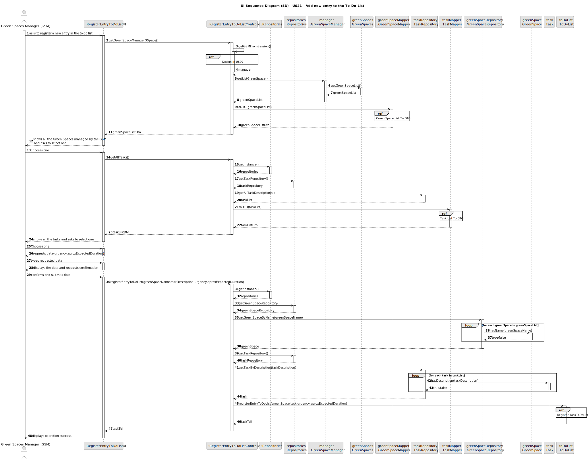
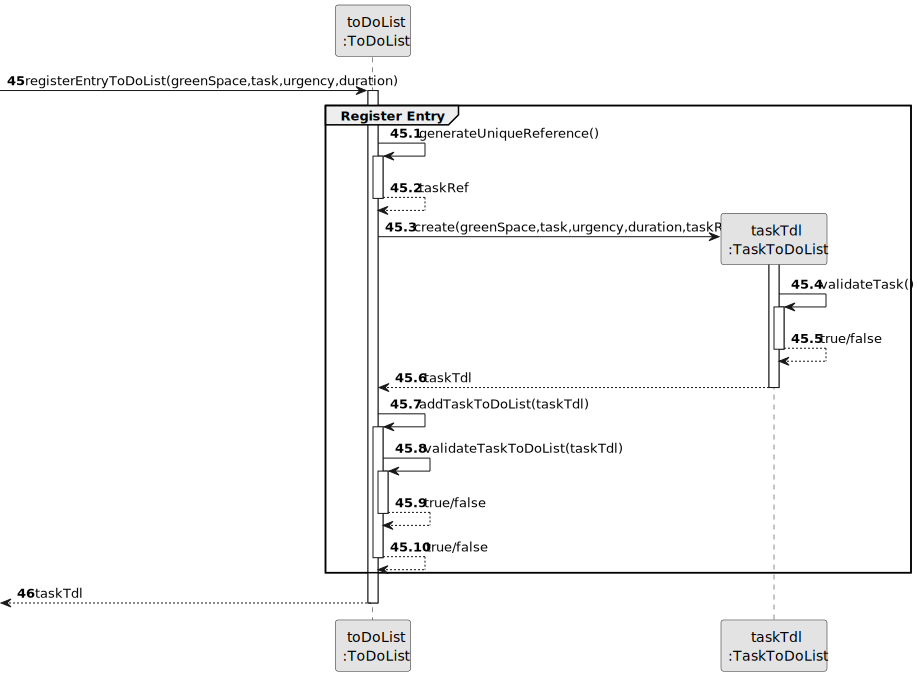

# US21 - Add new entry to the To-Do-List

## 3. Design - User Story Realization

### 3.1. Rationale

| Interaction ID | Question: Which class is responsible for...       | Answer                          | Justification (with patterns)                                                                                                       |
|:---------------|:--------------------------------------------------|:--------------------------------|:------------------------------------------------------------------------------------------------------------------------------------|
| Step 1  		     | 	... interacting with the actor?                  | RegisterEntryToDoListUI         | Pure Fabrication: there is no reason to assign this responsibility to any existing class in the Domain Model.                       |
| 			  		        | 	... coordinating the US?                         | RegisterEntryToDoListController | Pure Fabrication: Controller                                                                                                        |
| 			  		        | 	... instantiating a new entry in ToDoList?       | ToDoList                        | IE: knows/has its own TaskToDoList                                                                                                  |
| 			  		        | ... knowing the user using the system?            | UserSession                     | IE: cf. A&A component documentation.                                                                                                |
| 			  		        | 							                                           | ToDoList                        | IE: knows its own data (e.g. TaskToDoList)                                                                                          |
| 			  		        | 	... instantiating a new TaskToDoList?            | ToDoList                        | Creator:  (Rule 1): in the DM ToDoList has a TaskToDoList(Entries).  (Rule 2) : ToDoList records instances of TaskToDoList. |
| 			  		        | 							                                           | TaskToDoList                    | IE: knows its own data (e.g. urgency)                                                                                               |
| 			  		        | 							                                           | Task                            | IE: knows its own data (e.g. description)                                                                                           |
| 			  		        | 							                                           | GreenSpaces                     | Pure Fabrication: they form a collection of objects that do not “belong” to any domain object/class.                                |
| 			  		        | 							                                           | TaskRepository                  | Pure Fabrication: they form a collection of objects that do not “belong” to any domain object/class.                                |
| 			  		        | 							                                           | CollaboratorRepository          | Pure Fabrication: they form a collection of objects that do not “belong” to any domain object/class.                                |
| 			  		        | 							                                           | GreenSpaceRepository            | Pure Fabrication: they form a collection of objects that do not “belong” to any domain object/class.                                |
| Step 2         | ...knowing the list of GreenSpace by GSM to show? | GSM                             | IE:GreenSpace list managed by GSM.                                                                                                  |
| Step 3         | ... saving the selected type?                     | GreenSpace                      | IE: object created in step 1 is classified in one type.                                                                             |
| Step 4         | ...knowing the list of Tasks                      | TaskRepository                  | IE: knows/has its own Tasks                                                                                                         |
| Step 5         | ... saving the selected type?                     | Task                            | IE: object created in step 1 is classified in one type.                                                                             |
| Step 6         |                                                   |                                 |                                                                                                                                     |
| Step 7  		     | 	...saving the inputted data?                     | TaskToDoList                    | IE: object created in step 1 has its own data.                                                                                      |
| Step 8         |                                                   |                                 |                                                                                                                                     |
| Step 9  		     | 	...  TaskToDoList data (local validation)?       | TaskToDoList                    | IE: owns its data.                                                                                                                  | 
| 			  		        | 	... validating all data (global validation)?     | ToDoList                        | IE: knows all its TaskToDoList.                                                                                                     | 
| 			  		        | 	... saving the created TaskToDoList?             | ToDoList                        | IE: owns all its TaskToDoList.                                                                                                      | 
| Step 10  		    | 	... informing operation success?                 | RegisterEntryToDoListUI         | IE: is responsible for user interactions.                                                                                           | 

### Systematization ##

According to the taken rationale, the conceptual classes promoted to software classes are:

* GreenSpace
* GSM
* Task
* ToDoList
* TaskToDoList

Other software classes (i.e. Pure Fabrication) identified:

* RegisterEntryToDoListUI
* RegisterEntryToDoListController
* CollaboratorRepository
* GreenSpaceRepository
* TaskRepository
* GreenSpaces

## 3.2. Sequence Diagram (SD)

### Full Diagram

This diagram shows the full sequence of interactions between the classes involved in the realization of this user story.

### Split Diagrams

Get Green Space Manager

Get Green Space List

Add Entry To Do List

## 3.3. Class Diagram (CD)

