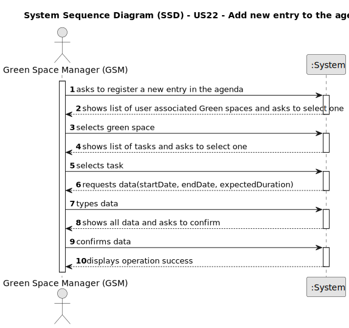

# US22 - Add new entry to the Agenda

## 1. Requirements Engineering

### 1.1. User Story Description

As a Green Space Manager (GSM), I want to add a new entry in the Agenda

### 1.2. Customer Specifications and Clarifications 

**From the specifications document:**

> Agenda entries can only be registered by a Green Space Manager (GSM).

**From the client clarifications:**

> **Question:** Can I add an entry that has a time period that already have an existing entry in the Agenda?
>
> **Answer:** Yes, because:
a) there are many parks to manage
b) different tasks can be executed at same time in the same park.

> **Question:**
When the GSM plans a task (that was previously in To-Do) into the Agenda, what aditional data/information does he need to input when planning?
> 
> **Answer:** The starting date for the task.
>
> Later the GSM will be able to add the Team and vehicles (if required).

> **Question:** When a new entry is added to the ToDo list, the default status of that task will be "pending" or no status at all is considered on ToDo list?
> 
> Similarly, when a new entry is added to the Agenda, the status of that task will be, by default, set to "planned", right?
> 
> **Answer:** "Pending" as default for to-do list entries and "Planned" as default for Agenda entries, sounds good;

> **Question:** Our team is unsure about what the exact inputs for the Green Space, To-Do List Entry, and Agenda entry exactly are. We understand that type (garden, medium-size, large-size), area, name, and address are required inputs for a Green Space (and if we are wrong in this, please correct us), but are there any other inputs that we are unaware of?
> 
> And when it comes to To-Do List entries, we identified a state (planned, postponed, completed, canceled), a green space, a title, and a description as inputs for a To-Do List entry. But are there any more? 
> 
> We also know that an Agenda entry has a target date, but is this target date supposed to be inputted upon transferring a task from the to-do list to the agenda, or is it supposed to be inputted upon creating the task in the to-do list?
> 
> Finally, during the last client meeting, we became aware that some tasks are meant to be reoccurring rather than occasional. Is this something that should be asked on creating the task in the to-do list? If so, what inputs should we expect from the user? The task's frequency in days?
> 
> **Answer:** Seems enough.
>
> In the text you can find: the degree of urgency (High, Medium,and Low), and the approximate expected duration.
> 
> To-do list entries doesn't have dates!
> 
> For the current proof-of-concept there is no need to distinguish between recurring and occasional tasks.

### 1.3. Acceptance Criteria

* **AC1:** The new entry must be associated with a green space managed by the GSM.
* **AC2:** The new entry must exist in the To-Do list.
* **AC3:** All required fields must be filled in.

### 1.4. Found out Dependencies

* There is a dependency on "US21 - Add new entry to the To-Do-List" as the new entry in the agenda must exist in the To-Do List.

### 1.5 Input and Output Data

**Input Data:**

* Typed data:
    * a start date

**Output Data:**
  * a list of green spaces
  * a list of tasks
  * (In)Success of the operation

### 1.6. System Sequence Diagram (SSD)

### 1.7 Other Relevant Remarks

* n/a