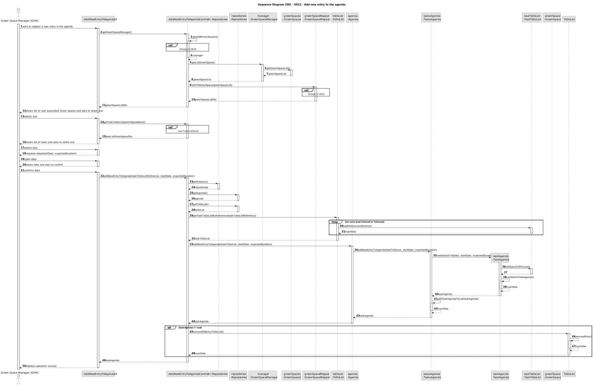
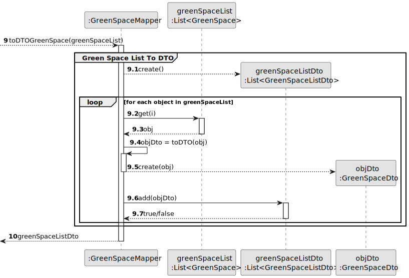
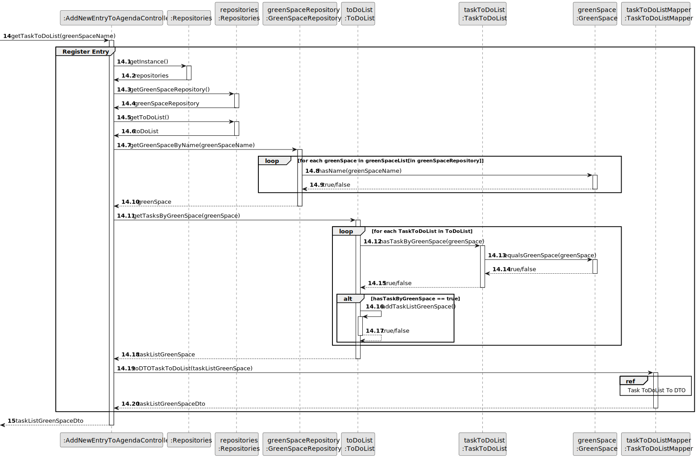

# US22 - Add new entry to the Agenda

## 3. Design - User Story Realization

### 3.1. Rationale

| Interaction ID | Question: Which class is responsible for...       | Answer                        | Justification (with patterns)                                                                                 |
|:---------------|:--------------------------------------------------|:------------------------------|:--------------------------------------------------------------------------------------------------------------|
| Step 1  		     | 	... interacting with the actor?                  | AddNewEntryToAgendaUI         | Pure Fabrication: there is no reason to assign this responsibility to any existing class in the Domain Model. |
| 			  		        | 	... coordinating the US?                         | AddNewEntryToAgendaController | Pure Fabrication: Controller                                                                                  |
| 			  		        | 	... instantiating a new entry in Agenda?         | Agenda                        | IE: knows/has its own TasksAgenda                                                                             |
| 			  		        | ... knowing the user using the system?            | UserSession                   | IE: cf. A&A component documentation.                                                                          |
| 			  		        | 							                                           | Agenda                        | IE: knows its own data (e.g. TasksAgenda)                                                                     |
| 			  		        | 	... instantiating a new TaskAgenda?              | TasksAgenda                   | Pure Fabrication: they form a collection of objects that do not “belong” to any domain object/class.          |
| 			  		        | 							                                           | TaskToDoList                  | IE: knows its own data (e.g. urgency)                                                                         |
| 			  		        | 							                                           | TasksAgenda                   | IE: knows/has its own data (e.g. TaskAgenda)                                                                  |
| 			  		        | 							                                           | Address                       | IE: knows its own data (e.g. street)                                                                          |
| 			  		        | 							                                           | PostCode                      | IE: knows its own data (e.g. localization)                                                                    |
| 			  		        | 							                                           | GreenSpaces                   | Pure Fabrication: they form a collection of objects that do not “belong” to any domain object/class.          |
| 			  		        | 							                                           | CollaboratorRepository        | Pure Fabrication: they form a collection of objects that do not “belong” to any domain object/class.          |
| 			  		        | 							                                           | GreenSpaceRepository          | Pure Fabrication: they form a collection of objects that do not “belong” to any domain object/class.          |
| Step 2         | ...knowing the list of GreenSpace by GSM to show? | GSM                           | IE:GreenSpace list managed by GSM.                                                                            |
| Step 3         | ... saving the selected type?                     | GreenSpace                    | IE: object created in step 1 is classified in one type.                                                       |
| Step 4         | ...knowing the list of TaskToDoList               | ToDoList                      | IE: knows/has its own TaskToDoList                                                                            |
| Step 5         | ... saving the selected type?                     | TaskToDoList                  | IE: object created in step 1 is classified in one type.                                                       |
| Step 6         |                                                   |                               |                                                                                                               |
| Step 7  		     | 	...saving the inputted data?                     | TaskAgenda                    | IE: object created in step 1 has its own data.                                                                |
| Step 8         |                                                   |                               |                                                                                                               |
| Step 9  		     | 	...  TaskToDoList data (local validation)?       | TaskAgenda                    | IE: owns its data.                                                                                            | 
| 			  		        | 	... validating all data (global validation)?     | TasksAgenda                   | IE: knows all its TaskAgenda.                                                                                 | 
| 			  		        | 	... saving the created TasksAgenda?              | TaskAgenda                    | IE: owns all its TasksAgenda.                                                                                 | 
| 			  		        | 	... saving the created TaskAgenda?               | Agenda                        | IE: owns all its TaskAgenda.                                                                                  | 
| 			  		        | 	... removing the selected TaskToDoList?          | ToDoList                      | IE: owns all its TaskToDoList.                                                                                |
| Step 10  		    | 	... informing operation success?                 | AddNewEntryToAgendaUI         | IE: is responsible for user interactions.                                                                     | 

### Systematization ##

According to the taken rationale, the conceptual classes promoted to software classes are:

* Agenda
* TaskToDoList
* ToDoList
* TaskAgenda
* Address
* PostCode

Other software classes (i.e. Pure Fabrication) identified:

* AddNewEntryToAgendaUI
* AddNewEntryToAgendaController
* CollaboratorRepository
* GreenSpaceRepository
* GreenSpaces
* TasksAgenda
* DTOGreenSpace
* GreenSpaceMapper
* DTOTaskToDoList
* TaskToDoListMapper

## 3.2. Sequence Diagram (SD)

### Full Diagram

This diagram shows the full sequence of interactions between the classes involved in the realization of this user story.

### Split Diagrams

Get Green Space Manager

DTO Green Space List

Get Task ToDoList

TaskToDoList To DTO

## 3.3. Class Diagram (CD)

