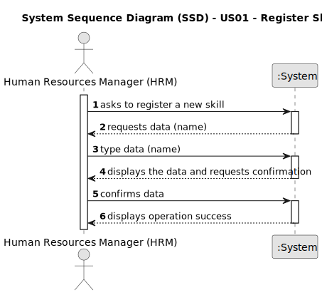

# US23 - Assign Team to entry in the Agenda

## 1. Requirements Engineering

### 1.1. User Story Description

As a GSM, I want to assign a Team to an entry in the Agenda

### 1.2. Customer Specifications and Clarifications

**From the specifications document:**

>

**From the client clarifications:**

> **Question:**
> Should the system able the HRM to introduce multiple skills in one interaction before saving all of them?
>
> **Answer:**
> it's not required to do so.

### 1.3. Acceptance Criteria

* **AC1:** A message must be sent to all team members informing them about the assignment.
* **AC2:** Different email services can send the message. These services must be defined through a configuration file to allow the use of different platforms (e.g. Gmail, DEI’s email service, etc.).

### 1.4. Found out Dependencies

* There is a dependency on "US05" and "US22" as there must be at least one team and entry in agenda to assign a team.

### 1.5 Input and Output Data

**Input Data:**

* Typed data:
    * a skill name

**Output Data:**

* (In)Success of the operation

### 1.6. System Sequence Diagram (SSD)

### 1.7 Other Relevant Remarks

* n/a