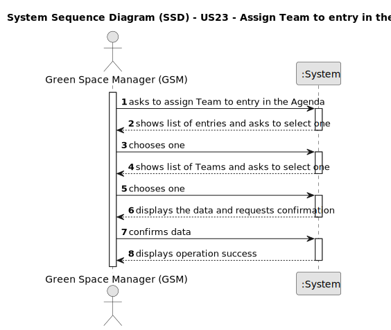

# US23 - Assign Team to entry in the Agenda

## 1. Requirements Engineering

### 1.1. User Story Description

As a GSM, I want to assign a Team to an entry in the Agenda.

### 1.2. Customer Specifications and Clarifications

**From the specifications document:**

> n/a

**From the client clarifications:**

> **Question:** Can a Team be assigned to multiple entrys?
>
> **Answer:** Yes.

> **Question:** Can an Agenda entry have more than one team assigned to it?
>
> **Answer:** No.

### 1.3. Acceptance Criteria

* **AC1:** A message must be sent to all team members informing them about the assignment.
* **AC2:** Different email services can send the message. These services must be defined through a configuration file to
  allow the use of different platforms (e.g. Gmail, DEI’s email service, etc.).

### 1.4. Found out Dependencies

* There is a dependency on "US05 - Generate team" and "US22 - Add new entry to the Agenda".

### 1.5 Input and Output Data

**Input Data:**

* Typed data:
    * n/a

**Output Data:**

* List of Teams
* List of Agenda Entries
* (In)Success of the operation

### 1.6. System Sequence Diagram (SSD)

### 1.7 Other Relevant Remarks

* Show only the entries in the parks' agenda associated to GSM