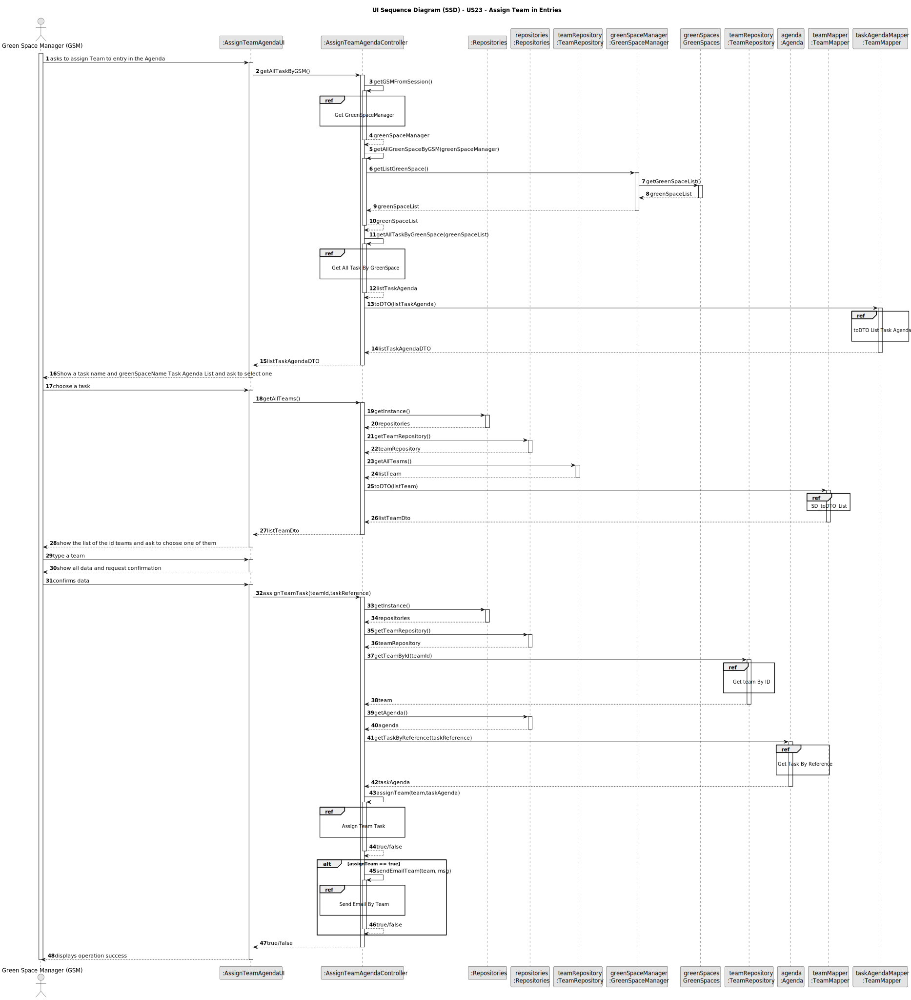

# US23 - Assign Team to entry in the Agenda

## 3. Design - User Story Realization

### 3.1. Rationale

| Interaction ID | Question: Which class is responsible for...   | Answer                     | Justification (with patterns)                                                                                 |
|:---------------|:----------------------------------------------|:---------------------------|:--------------------------------------------------------------------------------------------------------------|
| Step 1  		     | 	... interacting with the actor?              | AssignTeamAgendaUI         | Pure Fabrication: there is no reason to assign this responsibility to any existing class in the Domain Model. |
| 			  		        | 	... coordinating the US?                     | AssignTeamAgendaController | Controller                                                                                                    |
| 			  		        | ... knowing the user using the system?        | UserSession                | IE: cf. A&A component documentation.                                                                          |
| 			  		        | 							                                       | Agenda                     | IE: knows/has all tasks                                                                                       |
| 			  		        | 							                                       | Task                       | IE: knows its own data (e.g. description,duration,teamAssign and greenSpaceCarrieOut)                         |
| 			  		        | 							                                       | TeamRepository             | IE: knows/has all data                                                                                        |
| Step 2         | ...knowing the task to show?                  | Agenda                     | IE: Tasks are defined by the GSM in Agenda.                                                                   |
| Step 3  		     | 	...saving the inputted data?                 | Task                       | IE: object created in step 1 has its own data.                                                                |
| Step 4         | ...knowing the team to show?                  | TeamRepository             | IE: Team are defined by the HRM.                                                                              |
| Step 6  		     | 	...saving the inputted data?                 | Team                       | IE: object created in step 1 has its own data.                                                                |
| Step 6         |                                               |                            |
| Step 7  		     | 	...  all data (local validation)?            | Task                       | IE: owns its data.                                                                                            | 
| 			  		        | 	... validating all data (global validation)? | Agenda                     | IE: knows all its current tasks.                                                                              | 
| 			  		        | 	... saving the update Task?                  | Agenda                     | IE: owns all its tasks.                                                                                       | 
| Step 6  		     | 	... informing operation success?             | AssignTeamAgendaUI         | IE: is responsible for user interactions.                                                                     | 

### Systematization ##

According to the taken rationale, the conceptual classes promoted to software classes are:

* Team
* Task
* Agenda

Other software classes (i.e. Pure Fabrication) identified:

* AssignTeamAgendaUI
* AssignTeamAgendaController
* TeamRepository

## 3.2. Sequence Diagram (SD)

### Full Diagram

This diagram shows the full sequence of interactions between the classes involved in the realization of this user story.

### Split Diagrams

n/a

## 3.3. Class Diagram (CD)

