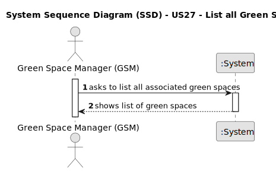

# US27 - List all Green Spaces

## 1. Requirements Engineering

### 1.1. User Story Description

As a GSM, I need to list all green spaces managed by me.

### 1.2. Customer Specifications and Clarifications 

**From the specifications document:**

> The list of green spaces must be sorted by size in descending order.

**From the client clarifications:**

> **Question:** Dear client, which info about Green Spaces do you want the GSM see when listing? only the name ?
>
> **Answer:** Each de team can decide about the aspects related to UX/UI.

### 1.3. Acceptance Criteria

* **AC1:** The list of green spaces must be sorted by size in descending order. The sorting algorithm to be used by the application must be defined through a configuration file. At least two sorting algorithms should be available.

### 1.4. Found out Dependencies

* n/a

### 1.5 Input and Output Data

**Input Data:**

* Typed data:
    * n/a

**Output Data:**

* List of associated Green Spaces

### 1.6. System Sequence Diagram (SSD)

### 1.7 Other Relevant Remarks

* n/a