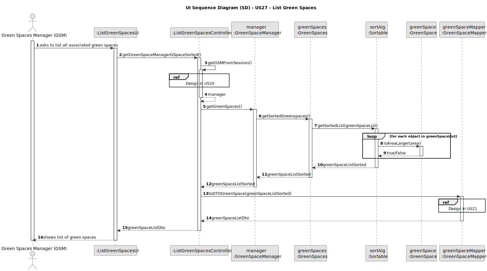
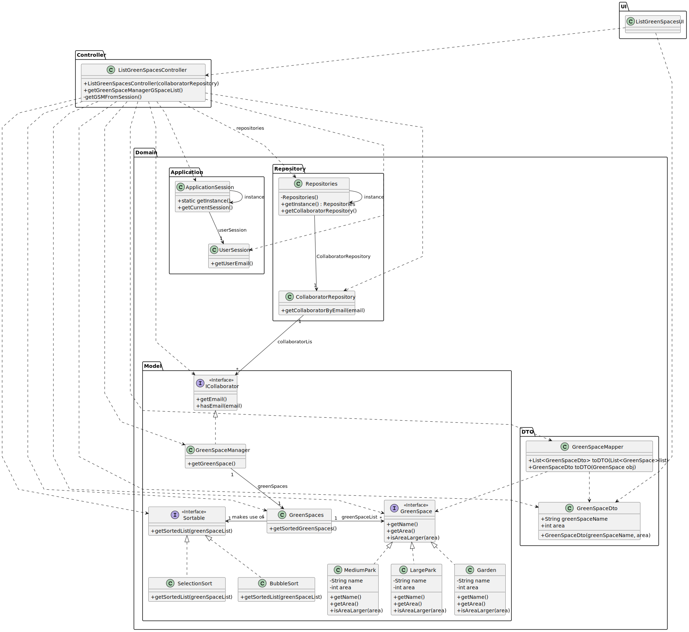

# US27 - List all Green Spaces

## 3. Design - User Story Realization

### 3.1. Rationale

| Interaction ID | Question: Which class is responsible for... | Answer                    | Justification (with patterns)                                                                                 |
|:---------------|:--------------------------------------------|:--------------------------|:--------------------------------------------------------------------------------------------------------------|
| Step 1  		     | 	... interacting with the actor?            | ListGreenSpacesUI         | Pure Fabrication: there is no reason to assign this responsibility to any existing class in the Domain Model. |
| 			  		        | 	... coordinating the US?                   | ListGreenSpacesController | Controller                                                                                                    |
| 			  		        | 	... instantiating GreenSpace List?         | GreenSpaceManager         | IE: knows/has its own GreenSpaces                                                                             |
| 			  		        | 							                                     | GreenSpaces               | IE: knows/has its own GreenSpace                                                                              |
| 			  		        | 							                                     | GreenSpace                | IE: knows its own data (e.g. area)                                                                            |
| 			  		        | 							                                     | SortingAlgorithm          | Pure Fabrication: there is no reason to assign this responsibility to any existing class in the Domain Model. |
| Step 2  		     | 	... informing operation success?           | RegisterSkillUI           | IE: is responsible for user interactions.                                                                     | 

### Systematization ##

According to the taken rationale, the conceptual classes promoted to software classes are:

* GreenSpace
* GreenSpaceManager
* GreenSpaces
* SortingAlgorithm

Other software classes (i.e. Pure Fabrication) identified:

* ListGreenSpacesUI
* ListGreenSpacesController

## 3.2. Sequence Diagram (SD)

### Full Diagram

This diagram shows the full sequence of interactions between the classes involved in the realization of this user story.

### Split Diagrams

Get Green Space Manager

## 3.3. Class Diagram (CD)

