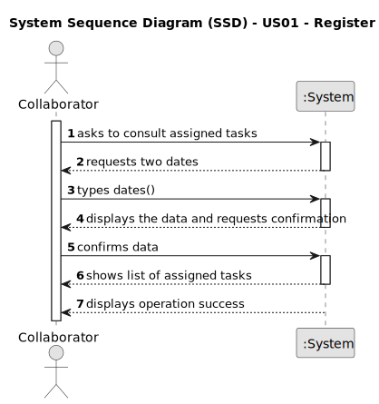

# US28 - Consult assigned tasks

## 1. Requirements Engineering

### 1.1. User Story Description

As a Collaborator, I wish to consult the tasks assigned to me between two dates

### 1.2. Customer Specifications and Clarifications 

**From the specifications document:**

> The list of tasks spaces must be sorted by date.
> The Collaborator should be able to filter the results by the status of the task.

**From the client clarifications:**

> **Question:**  
When a collaborator is registered, they are given an account with the registered email and a password? 
> 
>This allows them to log in and view their tasks later on. What should be the password for this collaborator's account?
>
> **Answer:**
Yes, it make sense.
> 
> About the password, not important in this stage of the project.

> **Question:** For a new entry in the agenda, if we assign it to a team, is this assigned to all members of the group? 
> 
>This could be contradictory because maybe one of the collaborators of the team doesn't have the skill to perform this task.
> 
> **Answer:** It depends in the granularity of the task.
> 
> If the task is Prunning Trees, besides the ones who will prune the tree, the team will need need someone who transports persons and machinery; someone who operates some kind of machinery; maybe a coordinator.

> **Question:**
While consulting tasks, how specific should be data presented to collaborator? 
> 
> Should it be all entries from the agenda with collaborator's team assigned or generic tasks that these entries refer to? 
> 
> As there is agenda entry, to-do list entry and task.
>
> **Answer:** A "generic task" is something like "task type" or "template task", for instance "Prunning Trees".
> 
> When a GSM decides to insert a entry in the To-Do list, he selects a generic task, selects a park, defines the expected duration and the urgency.
> 
> Later, that To-do List entry will originate an Entry in the Agenda with a starting date/time. That Entry can be managed due to actions/events that happens, hence the Entry can be Canceled, Postponed or Completed.

> **Question:** Do collaborators log in with a password (created by the respective manager when creating the collaborator), or with other information like the BI number or the TaxPayer?
>
> **Answer:** One can use email or taxpayer number.

> **Question:**
>why is the expected duration repeted in Task, To-Do-List Entry and Agenda entry. Is enough to give this atribute only to task?
>
>Apart, is correct to put the status in Task, or should it belongs to Agenda's entry only.
>
>Do we need to create first a task and them asociate it with a To-Do-List Entry or the creation of the task is the same of the creation of a To-Do-List Entry.
>
>Finally, an Agenda's entry is asociated with a team and then the team decides to which member/members belongs the task? Do we asociate a collaborator with the Agenda Entry, To-Do-List Entry or Task?
>
> **Answer:**
> you can have a generic task like "Prunning Trees" and you will have Entries in the To-Do List that relates to a task, park, urgency, expected duration.
>
> I'm not concerned how you will store/keep the information needed to provide the funcionality, it's not a Client concern ;-)
>
> Finally, the GSM ou HRM can generate teams and then assign a team to an entry in agenda. The collaborator is member of a team (please keep in consideration that the relation collaborator memberOf team should be valid during a specific time interval).

> **Question:**
> In the US28, the tasks consulted will be the ones that were assigned to the team/teams that collaborator is in, right?
>
> Why do we need to show a list of green spaces? Are we assuming that one collaborator could work in 2 different parks?
>
> What should be the output? The description of the task + the team (if the first sentence is correct)?
> 
> **Answer:**
> 1) right
> 
> 2) Yes, a collaborator can work in multiples green spaces
> 
> 3) Development teams can decide about the UX/UI related aspects of the solution.

### 1.3. Acceptance Criteria

* **AC1:** The list of tasks spaces must be sorted by date.
* **AC2:** The Collaborator should be able to filter the results by the status of the task.

### 1.4. Found out Dependencies

* There is a dependency on "US23 - Assign a team to entry in the agenda" as there must be tasks assigned to a collaborator.

### 1.5 Input and Output Data

**Input Data:**

* Typed data:
    * a start date
    * an end date

**Output Data:**

* List of assigned tasks
* (In)Success of the operation

### 1.6. System Sequence Diagram (SSD)

### 1.7 Other Relevant Remarks

* n/a