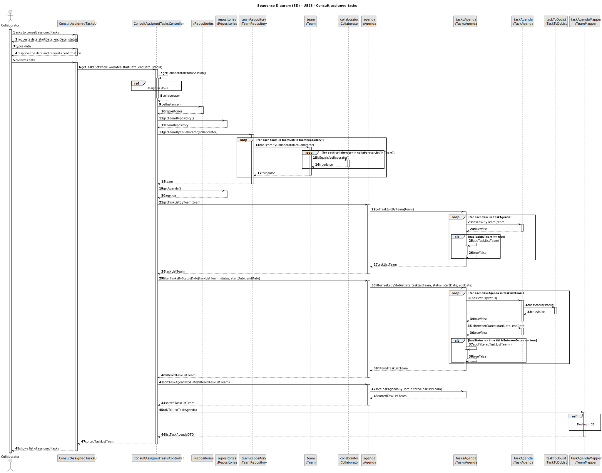
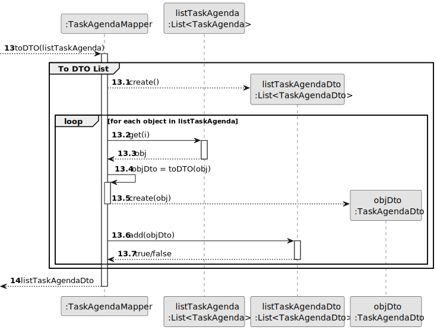
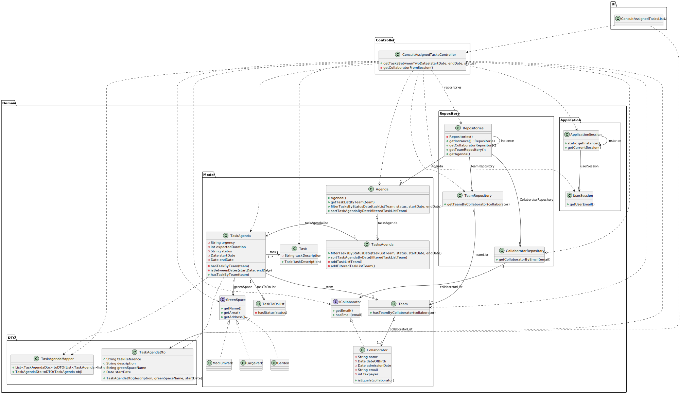

# US28 - Consult assigned tasks

## 3. Design - User Story Realization

### 3.1. Rationale

| Interaction ID | Question: Which class is responsible for... | Answer                         | Justification (with patterns)                                                                                                   |
|:---------------|:--------------------------------------------|:-------------------------------|:--------------------------------------------------------------------------------------------------------------------------------|
| Step 1  		     | 	... interacting with the actor?            | ConsultAssignedTasksUI         | Pure Fabrication: there is no reason to assign this responsibility to any existing class in the Domain Model.                   |
| 			  		        | 	... coordinating the US?                   | ConsultAssignedTasksController | Controller                                                                                                                      |
| 			  		        | 	                                           | Agenda                         | IE: knows all its taskAgenda.                                                                                                   |
| 			  		        | 							                                     | TaskAgenda                     | IE: knows its own data (e.g. description)                                                                                       |
| 			  		        | 							                                     | TeamRepository                 | Pure Fabrication: they form a collection of objects that do not “belong” to any domain object/class. IE: Knows all its Teams |
| 			  		        | 	                                           | TasksAgenda                    | Pure Fabrication: they form a collection of objects that do not “belong” to any domain object/class. IE: Knows all its Teams |
| Step 2         |                                             |                                |                                                                                                                                 |
| Step 3  		     | 	                                           |                                |                                                                                                                                 |
| Step 4         | ...shows data and requests confirmation     | ConsultAssignedTasksUI         | IE: is responsible for user interactions.                                                                                       |
| Step 5  		     |                                             |                                |                                                                                                                                 |
| Step 6  		     | 	... shows data                             | ConsultAssignedTasksUI         | IE: is responsible for user interactions.                                                                                       | 

### Systematization ##

According to the taken rationale, the conceptual classes promoted to software classes are:

* Agenda
* TaskAgenda

Other software classes (i.e. Pure Fabrication) identified:

* ConsultAssignedTasksUI
* ConsultAssignedTasksController
* TeamRepository
* TasksAgenda

## 3.2. Sequence Diagram (SD)

### Full Diagram

This diagram shows the full sequence of interactions between the classes involved in the realization of this user story.

### Split Diagrams

Get Collaborator

Get Collaborator

toDTO List Task Agenda

## 3.3. Class Diagram (CD)

