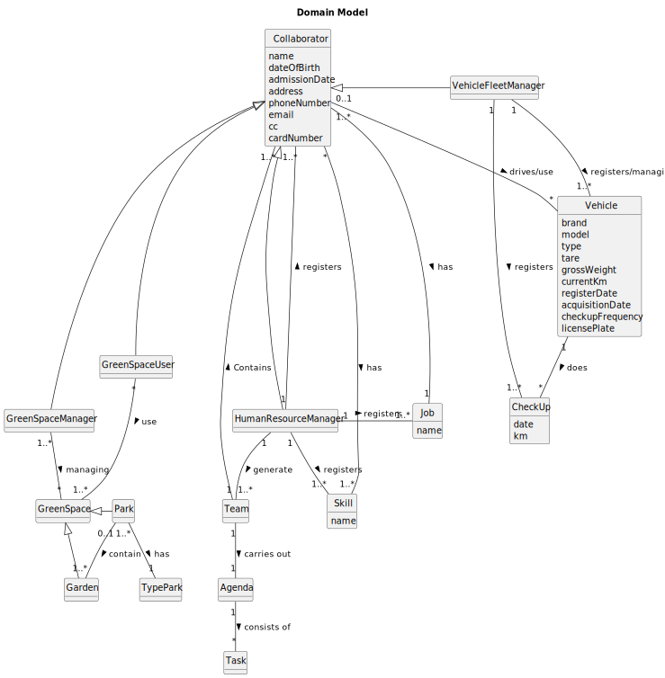

# OO Analysis

The construction process of the domain model is based on the client specifications, especially the nouns (for _concepts_) and verbs (for _relations_) used.

## Rationale to identify domain conceptual classes
To identify domain conceptual classes, start by making a list of candidate conceptual classes inspired by the list of categories suggested in the book "Applying UML and Patterns: An Introduction to Object-Oriented Analysis and Design and Iterative Development".

### _Conceptual Class Category List_

**Business Transactions**

* Skills
* Vehicles
* Job
* Collaborator
* Team
* Check-up

---

**Transaction Line Items**

* Skills
* Vehicles

---

**Product/Service related to a Transaction or Transaction Line Item**

* Check-up

---

**Transaction Records**

* Collaborator
* Skills
* Job
* Vehicles

---  

**Roles of People or Organizations**

* (HRM) Human Resources Manager
* (VFM) Vehicle and Equipment Fleet Manager
* Collaborator
* Green Spaces Manager
* Green Spaces User

---

**Places**

* Garden
* Medium-sized park
* Large-sized par
  

---

**Noteworthy Events**

* 

---

**Physical Objects**

* Vehicles/GreenSpace/Tools/Equipments

---

**Descriptions of Things**

* 

---

**Catalogs**

* 

---

**Containers**

* GreenSpaces

---

**Elements of Containers**

* Infrastructures
* Wooded garden area
* Equipment
* Services

---

**Organizations**

* MusgoSublime (MS)

---

**Other External/Collaborating Systems**

* (HRM) Human Resources Manager
* (VFM) Vehicle and Equipment Fleet Manager
* Collaborator
---

**Records of finance, work, contracts, legal matters**

* 

---

**Financial Instruments**

* 

---

**Documents mentioned/used to perform some work/**

* Check-up

---

## Rationale to identify associations between conceptual classes

An association is a relationship between instances of objects that indicates a relevant connection and that is worth of remembering, or it is derivable from the List of Common Associations:

| Concept (A) 	        | Association        | Concept (B)      |  
|-----------------------|:------------------:|-----------------:|
|Collaborator           |   Has	             |    Job           |
|Collaborator  	        |   Drives    	     |    Vehicle       |
|Collaborator  	        |   Has   	         |    Skill         |
|Team  	                |   Contains  	     |    Collaborator  |
|HumanResourceManager  	|   Registers    	 |    Job           |
|HumanResourceManager   |   Registers    	 |    Collaborator  |     
|HumanResourceManager  	|   Registers    	 |    Skill         |
|VehicleFleetManager  	|   Registers  	     |    Vehicle       |
|Vehicle  	            |   Does   	         |    CheckUp       |
|HumanResourceManager  	|   Generalization   |    Collaborator  |
|VehicleFleetManager    |   Generalization   |    Collaborator  |

## Domain Model

**Do NOT forget to identify concept atributes too.**

**Insert below the Domain Model Diagram in a SVG format**

