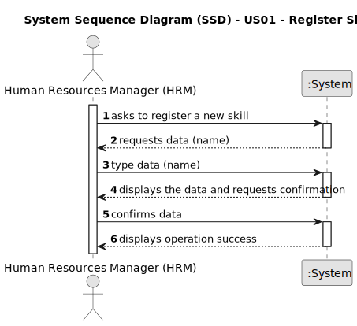

# US01 - Register Skills

## 1. Requirements Engineering

### 1.1. User Story Description

As a Human Resources Manager (HRM), I want to register skills that a collaborator may have.

### 1.2. Customer Specifications and Clarifications 

**From the specifications document:**

> Skills can only be registered by a Human Resources Manager (HRM).

**From the client clarifications:**

> **Question:**  Which information can be introduced to create a new skill?
>
> **Answer:** The skill name.

> **Question:** Which information is mandatory for creating a new skill?
>
> **Answer:** The skill name.

> **Question:** Which are the skills accepted? Or should we enable the HRM to introduce anything as a skill?
>
> **Answer:** All, it's up to HRM to decide. (special characters or algarisms should not be allowed in the skill name).

> **Question:** Que criterios sao necessarios para registar uma skill?
>
> **Answer:** o nome da skill, por exemplo:
> podador
> condutor de veiculos pesados
> aplicador de fito-farmacos

> **Question:** Quando é criado uma skill que ja existe o que sistema devera fazer?
>
> **Answer:** Por definição não é possível ter valores duplicados num conjunto. A verificação de duplicados não é uma
> regra de negócio é do nível tecnológico.

> **Question:**
>1. Do I need to add skills by writing them or can I just give a file with all of the skills?
>2. Does the HRM need to see the confirmation of the sucess of the operation and the skills added or just the sucess of
    the operation?
>3. Is there any other possible outcome like if the HMR does not put the requested data, do I need to ask the user to to
    register a diferent competence?
>
> **Answer:**
>1. Both are acceptable since the business the same the crucial difference resides in the UX.
>2. It will depend if you opt to insert one skil or a set of skils in a batch. Maybe some adaptation needed.
>3. This US is quite simple, atm a skill is simply a name.

### 1.3. Acceptance Criteria

* **AC1:** All required fields must be filled in.
* **AC2:** Special characters or algarisms should not be allowed in the skill name.
* **AC3:** When creating a task with an existing reference, the system must reject such operation and the user must be able to modify the typed reference.

### 1.4. Found out Dependencies

* n/a

### 1.5 Input and Output Data

**Input Data:**

* Typed data:
    * a skill name

**Output Data:**

* (In)Success of the operation

### 1.6. System Sequence Diagram (SSD)

### 1.7 Other Relevant Remarks

* n/a