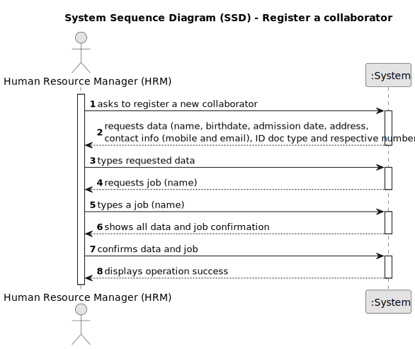

# US03 - Register a collaborator

## 1. Requirements Engineering

### 1.1. User Story Description

US03 - As a Human Resource Manager, I want to register a collaborator with a job and fundamental characteristics.

### 1.2. Customer Specifications and Clarifications

*From the specifications document:*

>Skills can only be registered by a Human Resources Manager (HRM).

*From the client clarifications:*

>**Question:** When creating a collaborator with an existing name ... What the system do?
>
>What characteristics are important to success the register?
>
>**Answer:** It's not common and most improbable to have different individual with same name in the same context, however it’s ID documentation number should be unique for sure.
>
>I believe that question was already answered, name, birthdate, admission date, id doc type, id doc number, contact info (email, mobile), address.

>**Question:** Should the system able the HRM to insert multiple collaborators in one interaction before saving them?
>
>**Answer:** it's not required to do so.

>**Question:** I have some questions regarding the business rules of this US:
>
> Is there any limitation regarding the length of the name of the collaborator?
>
> Should we consider valid only the birthdates in which the collaborator has more than 18 years?
>
> What should be the format for the phone number? 9 numbers?
>
> What is the format for the numbers from the id doc types?
>
>Are there any other business rules?
>
>**Answer:** According to the Portuguese law a name should contain at maximum six words;
>
> yes;
>
> validating 9 digits will be acceptable; validating with international format would be excelent;
>
> each doc type has specific formats like taxpayer number, Citizen Card ou passport.

### 1.3. Acceptance Criteria

* *AC1:* Name, birthdate, admission date, address, contact info (mobile and email), ID doc type and respective number should be provided by HRM.
* *AC2:* All required fields must be filled in.
* *AC3:* Id doc number must be unique.
* *AC4:* Name can have 6 words maximum.
* *AC5:* Dates must follow this format: dd-mm-yyyy.
* *AC6:* Need to certify that the collaborator has at least 18 years of age.
* *AC7:* Phone number needs to use this format: +999(max 3 numbers) 999999999

* ### 1.4. Found out Dependencies

* There is a dependency on "US02 - Register a job" as there must be at least one job to register a collaborator.

### 1.5 Input and Output Data

*Input Data:*

* Typed data:
  * a name
  * a birthdate
  * an admission date
  * an address
  * a mobile phone number
  * an email
  * an id doc type
  * an id doc number
  * a job (name)

*Output Data:*

* (In)Success of the operation

### 1.6. System Sequence Diagram (SSD)

### 1.7 Other Relevant Remarks

* N/A.