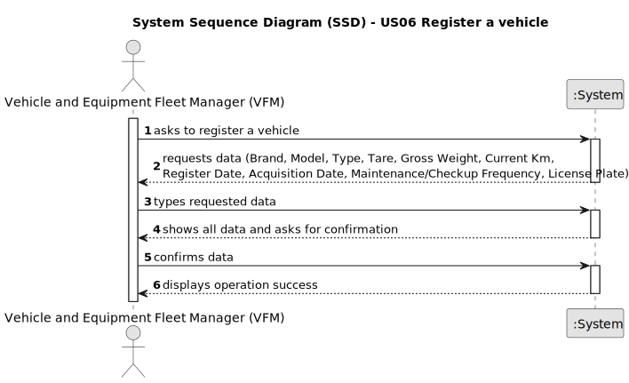

# US06 - Register a vehicle

## 1. Requirements Engineering

### 1.1. User Story Description

As an FM, I wish to register a vehicle including Brand, Model, Type, Tare,
Gross Weight, Current Km, Register Date, Acquisition Date, Maintenance/Checkup Frequency (in Kms).

### 1.2. Customer Specifications and Clarifications 

**From the specifications document:**

> Vehicles can only be registered by the Vehicle and Equipment Fleet Manager (VFM).
>
> Vehicles must be registered with a licence plate, a brand, a model, a type, a tare,
a gross weight, a current Km, a register date, an acquisition date, a maintenance/checkup frequency (in Kms).

**From the client clarifications:**

> **Question:** For the application to work does the FM need to fill all the attributes of the vehicle?
>
> **Answer:** yes, besides the vehicle plate that by mistake doesn't appear on the text.

> **Question:** What are the validation requirements for the vehicle ID?
>
> **Answer:**
>- After 2020: AA-00-AA
>- between 2005-2020 00-AA-00
>- between 1992-2005 00-00-XX

> **Question:**
>- Should the application identify a registered vehicle by a serial number or other attribute?
>- Should the application a group the vehicles by their brand, serial number or other attribute?
>- If the Fm inserts the same vehicle by mistake, should it inform ther user of the mistake and give him the option to add another vehicle?
>
> **Answer:**
>- By plate id;
>- no requirements were set concerning groups of vehicles;
>- again, duplication of data is not a business rule is technical one, since by definition in a set you cant have duplicates.

> **Question:**  - When a vehicle is registered, are there specific requirements for accepting the brand? For example, does the system need to check if the brand is on a predetermined list? Does this also apply to the model or any other characteristics?
>
> **Answer:** no; one can consider a list os brands and a list of models previsously inserted in the system, no need to go through validations.

> **Question:** can a fm register no vehicles or does he have to regsiter at least one?
>
> **Answer:**
The VFM is a role or system user profile that has the rights to perform some system actions (like the ones described by the US06, US07 and US08).
In theory If there is no need to registering a vehicle, no vehicles will be registered but that would be rather odd.

### 1.3. Acceptance Criteria

* **AC1:** All required fields must be filled in.
* **AC2:** When registering a vehicle with an existing licence plate, the system must reject such operation and the user must be able to modify the typed licence plate.
* **AC3:** The licence plate must follow the following format: After 2020: AA-00-AA | 
between 2005-2020 00-AA-00 | 
between 1992-2005 00-00-XX

### 1.4. Found out Dependencies

* n/a

### 1.5 Input and Output Data

**Input Data:**

* Typed data:
    * a Brand
    * a Model 
    * a Type
    * a Tare
    * a Gross Weight
    * a Current Km
    * a Register Date
    * an Acquisition Date
    * a Maintenance/Checkup Frequency (in Kms).
    * a Licence Plate

**Output Data:**

* (In)Success of the operation

### 1.6. System Sequence Diagram (SSD)

### 1.7 Other Relevant Remarks

* n/a