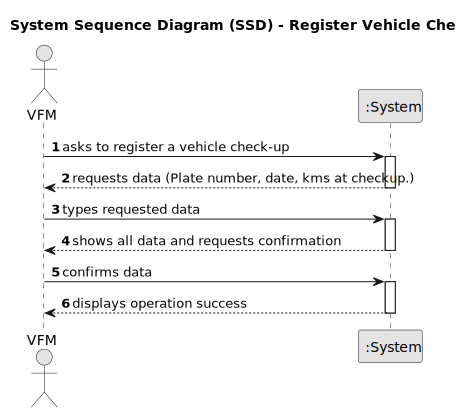

# US07 - Register a vehicle’s check-up.

## 1. Requirements Engineering

### 1.1. User Story Description

US07 - As a Vehicle and Equipment Fleet Manager, I want to register a vehicle’s check-up.

### 1.2. Customer Specifications and Clarifications 

**From the specifications document:**

>	Each task is characterized by having a unique reference per organization, a designation, an informal and a technical description, an estimated duration and cost, as well as a task category. 

>	As long as it is not published, access to the task is exclusive to the employees of the respective organization. 

**From the client clarifications:**

> **Question:** Can a vehicle have more than one check-up?
>
> **Answer:** Yes.

> **Question:** Which attributes will you need for the vehicle's check-up?
>
> **Answer:** Plate number, date, kms at checkup.
 
### 1.3. Acceptance Criteria

* **AC1:** All required fields must be filled in.
* **AC2:** When creating a task with an existing reference, the system must reject such operation and the user must be able to modify the typed reference.

### 1.4. Found out Dependencies

* There is a dependency on "US006 - Register vehicle" as there must be at least one vehicle to be able to do a check-up.

### 1.5 Input and Output Data

**Input Data:**

* Typed data:
    * a plate number
    * a date
    * the km at checkup

**Output Data:**

* (In)Success of the operation

### 1.6. System Sequence Diagram (SSD)

### 1.7 Other Relevant Remarks

* The created task stays in a "not published" state in order to distinguish from "published" tasks.