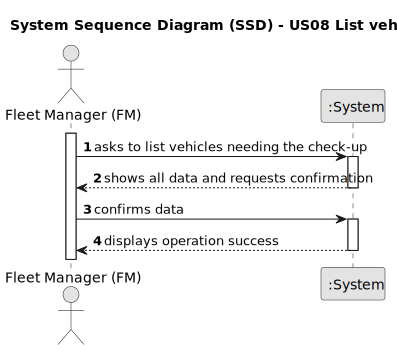

# US08 - As an FM, I want to list the vehicles needing the check-up.

## 1. Requirements Engineering

### 1.1. User Story Description

As an FM, I want to list the vehicles needing the check-up.

### 1.2. Customer Specifications and Clarifications 

**From the specifications document:**

>List of vehicles needing the check-up.

**From the client clarifications:**

> **Question:** 1- Can the vehicles get placed automatically on a list or the one listing has to be the FM?
2- What information will appear on the final list regarding the vehicle,besides the needing for check-up?
>
> **Answer:** Not sure if fully undertstand the question but I'll try to answer: 1. the list of vehicles is automatically created but the creation is triggered by the FM. 2. Data that allow to identify the vehicle like Plate, brand and modle, as well as, the data that allowed to select/insert te vehicle in the list, number of kms, frequecny of checkup and the last checkup.

> **Question:** What are the requests/ input data to list the vehicles needing the check-up? Type of vehicle, Current Km and Maintenance/Check-up Frequency (in Kms) are sufficient? 
> Are there acceptance criteria when asking for the list?
>
> **Answer:** Current Km and Maintenance/Check-up Frequency (in Kms) are sufficient, yes;
he list must contain all vehicles that have already exceeded the number of km required for the inspection or those that are close to it.
For example:
a vehicle that made the checkup at 23500 and has a checkup frequency of 10000km.
a) If it currently has 33600 (exceeded) or
b) 33480 (there is a difference minor than 5% of the number of kms of the checkup frequency).
The list must clearly identify the vehicles through: plate number, brand, model and the that justified the checkup need.

### 1.3. Acceptance Criteria

* **AC1:** The list must contain all vehicles that have already exceeded the number of km required for the inspection or those that are close to it.
* **AC2:** The list must clearly identify the vehicles through: plate number, brand, model and the that justified the checkup need.

### 1.4. Found out Dependencies

* There is a dependency on " US07 - As an FM, I wish to register a vehicle’s check-up" as there must be at least one vehicle check-up created.

### 1.5 Input and Output Data

**Input Data:**

* Typed data:
    * vehicle
    * Current Km
    * Maintenance/Check-up Frequency

**Output Data:**

* (In)Success of the operation

### 1.6. System Sequence Diagram (SSD)

**_Other alternatives might exist._**

### 1.7 Other Relevant Remarks

n/a